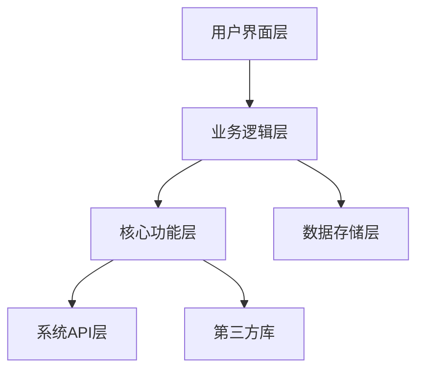

# 智能磁盘清理与数据治理工具技术设计文档

## 1. 技术架构设计

### 1.1 整体架构



### 1.2 技术栈

| 类别 | 技术/库 | 版本 | 用途 |
|------|---------|------|------|
| 开发语言 | C# | 8.0+ | 主要开发语言 |
| UI框架 | WPF | .NET 4.6.2+ | 用户界面开发 |
| 系统API | Windows API | - | 系统文件操作 |
| 存储 | 本地配置文件 | XML/JSON | 存储用户设置和清理历史 |
| 数据可视化 | LiveCharts | 0.9.7+ | 图表和数据展示 |
| 对话框增强 | Ookii.Dialogs.Wpf | 4.0+ | 增强的对话框功能 |
| JSON处理 | Newtonsoft.Json | 13.0+ | JSON序列化和反序列化 |
| 日志 | NLog | 4.7+ | 日志记录 |

### 1.3 模块划分

| 模块 | 职责 | 文件位置 |
|------|------|----------|
| 主应用模块 | 应用启动和主界面 | `src/CleanMasterPro/MainWindow.xaml` |
| 扫描模块 | 文件扫描和分析 | `src/CleanMasterPro/Modules/Scan/` |
| 清理模块 | 文件清理和恢复 | `src/CleanMasterPro/Modules/Clean/` |
| 可视化模块 | 磁盘空间可视化 | `src/CleanMasterPro/Modules/Visualization/` |
| 智能归类模块 | 文件夹智能归类 | `src/CleanMasterPro/Modules/Categorization/` |
| 数据治理模块 | 文件结构优化 | `src/CleanMasterPro/Modules/Governance/` |
| 多磁盘管理模块 | 多磁盘分区管理 | `src/CleanMasterPro/Modules/DiskManagement/` |
| 系统优化模块 | 系统设置优化 | `src/CleanMasterPro/Modules/SystemOptimization/` |
| 自动清理模块 | 定期自动清理 | `src/CleanMasterPro/Modules/AutoClean/` |
| 安全保障模块 | 文件安全和权限管理 | `src/CleanMasterPro/Modules/Security/` |
| 工具模块 | 通用工具和辅助功能 | `src/CleanMasterPro/Utils/` |

## 2. 核心功能模块技术实现

### 2.1 多磁盘管理模块

#### 2.1.1 技术实现

- **磁盘检测**：使用`System.IO.DriveInfo`类获取系统中所有磁盘分区信息
- **磁盘状态监控**：通过`PerformanceCounter`类监控磁盘使用情况和健康状态
- **并行处理**：使用`Task Parallel Library (TPL)`实现多磁盘并行扫描和清理
- **磁盘容量计算**：使用`GetDiskFreeSpaceEx` API获取准确的磁盘空间信息

#### 2.1.2 风险规避

- **磁盘访问异常**：实现异常处理机制，确保某个磁盘访问失败不会影响其他磁盘的操作
- **权限不足**：在访问磁盘前检查权限，对于权限不足的磁盘提供友好提示
- **磁盘错误**：监控磁盘错误，及时向用户报告潜在问题

### 2.2 扫描模块

#### 2.2.1 技术实现

- **多线程扫描**：使用`Parallel.ForEach`实现多线程并行扫描
- **增量扫描**：通过记录上次扫描时间，只扫描修改时间晚于该时间的文件
- **智能过滤**：使用正则表达式和白名单机制过滤系统关键文件
- **文件类型识别**：基于文件扩展名和内容特征识别文件类型
- **使用频率分析**：通过`GetFileTime` API获取文件访问时间，分析使用频率

#### 2.2.2 风险规避

- **扫描性能**：实现扫描进度监控和可中断机制，避免长时间扫描影响系统性能
- **内存占用**：使用流式处理，避免一次性加载所有文件信息到内存
- **文件锁定**：处理文件锁定情况，跳过无法访问的文件
- **系统文件保护**：建立系统文件白名单，确保不会误删系统关键文件

### 2.3 清理模块

#### 2.3.1 技术实现

- **文件删除**：使用`File.Delete`和`Directory.Delete`实现文件和文件夹删除
- **安全删除**：提供可选的安全删除功能，使用多次覆盖确保数据不可恢复
- **操作备份**：在删除前备份文件信息到本地数据库，支持恢复
- **文件恢复**：从备份中恢复误删除的文件

#### 2.3.2 风险规避

- **误删保护**：实现文件删除前的确认机制，特别是对于重要文件
- **删除失败**：处理删除失败的情况，提供详细的错误信息
- **恢复机制**：确保删除操作可恢复，避免不可逆的错误

### 2.4 空间可视化模块

#### 2.4.1 技术实现

- **树形结构分析**：使用递归遍历构建文件系统树形结构
- **热图生成**：基于文件大小和类型生成磁盘空间热图
- **3D可视化**：使用WPF的3D功能实现立体展示
- **实时更新**：使用`FileSystemWatcher`监控文件系统变化，实时更新可视化

#### 2.4.2 风险规避

- **性能优化**：对于大磁盘，实现数据采样和分层加载，避免内存占用过高
- **3D渲染性能**：根据系统配置自动调整3D效果，在低配置机器上禁用3D可视化
- **响应速度**：实现异步加载和渲染，确保界面响应流畅

### 2.5 智能归类模块

#### 2.5.1 技术实现

- **文件夹识别**：基于路径模式和文件特征识别应用程序和系统文件夹
- **安全标记**：使用规则引擎标记重要文件夹
- **归类算法**：基于文件类型、路径和使用频率的智能归类算法
- **用户反馈学习**：记录用户的归类调整，优化归类算法

#### 2.5.2 风险规避

- **归类准确性**：提供手动调整机制，允许用户纠正自动归类结果
- **重要文件保护**：对系统和应用程序文件夹进行特殊标记，防止误操作

### 2.6 数据治理模块

#### 2.6.1 技术实现

- **AI驱动分析**：使用ML.NET实现基于机器学习的文件分析
- **重复文件检测**：基于文件内容哈希值的重复文件检测
- **结构分析**：分析文件夹层次结构，提供优化建议
- **智能命名**：基于文件内容和上下文生成智能命名建议

#### 2.6.2 风险规避

- **AI模型性能**：使用轻量级AI模型，确保在低配置机器上也能流畅运行
- **误判处理**：提供人工干预机制，纠正AI的错误判断
- **数据安全**：确保AI分析过程中不会泄露用户隐私

### 2.7 自动清理模块

#### 2.7.1 技术实现

- **任务调度**：使用`Task Scheduler` API实现定期自动清理任务
- **后台执行**：在后台线程执行清理操作，不影响用户操作
- **通知机制**：使用系统通知功能通知清理完成

#### 2.7.2 风险规避

- **系统负载**：在系统空闲时执行自动清理，避免影响系统性能
- **任务失败**：实现任务失败重试机制，确保清理任务可靠执行

### 2.8 系统优化模块

#### 2.8.1 技术实现

- **启动项管理**：通过修改注册表管理启动项
- **服务优化**：通过`ServiceController`管理系统服务
- **注册表清理**：安全清理无效的注册表项
- **优化备份**：在优化前备份系统设置，支持恢复

#### 2.8.2 风险规避

- **操作安全**：所有系统修改操作都有备份，确保可恢复
- **权限管理**：以管理员权限运行，确保能够执行系统优化操作
- **兼容性**：针对不同Windows版本提供不同的优化策略

## 3. 数据存储设计

### 3.1 配置文件

- **用户设置**：使用XML或JSON格式存储用户偏好设置
- **清理历史**：记录清理操作历史，支持文件恢复
- **白名单**：存储系统关键文件和用户指定的白名单

### 3.2 数据结构

#### 3.2.1 清理历史记录

```json
{
  "cleanHistory": [
    {
      "id": "1",
      "timestamp": "2026-03-29T10:00:00",
      "disk": "C:",
      "cleanType": "快速扫描",
      "filesDeleted": [
        {
          "path": "C:\\Temp\\file1.tmp",
          "size": 1024000,
          "backupPath": "C:\\CleanMasterPro\\Backup\\1\\file1.tmp"
        }
      ],
      "totalSize": 1024000
    }
  ]
}
```

#### 3.2.2 用户设置

```json
{
  "userSettings": {
    "general": {
      "language": "zh-CN",
      "theme": "light",
      "startup": false
    },
    "clean": {
      "defaultItems": ["temp", "cache", "logs"],
      "cleanLevel": "standard"
    },
    "autoClean": {
      "enabled": true,
      "frequency": "weekly",
      "time": "22:00",
      "targetDisks": ["C:", "D:"]
    },
    "visualization": {
      "defaultView": "pie",
      "enable3D": true
    },
    "security": {
      "whitelist": ["C:\\Windows", "C:\\Program Files"]
    }
  }
}
```

## 4. 安全性设计

### 4.1 文件安全

- **文件白名单**：预设系统关键文件和文件夹白名单，防止误删
- **权限检查**：在删除文件前检查文件权限，避免删除受保护文件
- **操作确认**：重要操作需要用户确认，避免误操作
- **备份机制**：所有删除操作都有备份，支持恢复

### 4.2 系统安全

- **权限管理**：以管理员权限运行，确保能够访问系统文件
- **安全执行**：在安全上下文中执行系统操作，避免安全风险
- **异常处理**：妥善处理系统异常，避免系统崩溃

### 4.3 数据安全

- **隐私保护**：不收集用户个人数据，所有数据存储在本地
- **备份安全**：备份文件加密存储，确保数据安全
- **日志安全**：日志中不包含敏感信息

## 5. 性能优化策略

### 5.1 内存优化

- **内存池管理**：使用对象池和内存池技术，减少内存分配和回收，针对频繁创建的对象（如文件信息结构体）使用对象池
- **延迟加载**：按需加载功能和数据，减少启动时的内存占用，例如只在需要时加载3D可视化模块
- **资源释放**：及时释放不再使用的资源，避免内存泄漏，使用using语句和IDisposable接口确保资源正确释放
- **内存监控**：实时监控内存使用情况，当内存占用超过预设阈值时，自动调整内存使用策略
- **数据压缩**：对大型数据结构（如文件列表）使用压缩存储，减少内存占用
- **内存回收**：定期触发垃圾回收，特别是在大型操作后

### 5.2 扫描性能

- **多线程扫描**：使用并行处理提高扫描速度，根据CPU核心数动态调整线程数量
- **增量扫描**：只扫描变化的文件，减少扫描时间，通过记录上次扫描的文件修改时间实现
- **智能过滤**：跳过系统关键文件和用户指定的白名单文件，使用预编译的正则表达式提高过滤速度
- **扫描进度控制**：实现可中断的扫描过程，允许用户随时停止扫描
- **优先级调度**：对不同类型的文件设置扫描优先级，优先扫描临时文件和缓存文件
- **磁盘I/O优化**：使用异步I/O操作，减少I/O等待时间

### 5.3 UI性能

- **异步操作**：UI操作与后台操作分离，确保界面响应流畅，使用Task和async/await模式
- **虚拟化**：使用UI虚拟化技术，高效处理大量数据展示，特别是在文件列表和空间可视化中
- **缓存机制**：缓存频繁访问的数据，减少重复计算，例如缓存文件类型图标和常用操作结果
- **按需渲染**：只渲染可见区域的内容，提高渲染性能，特别是在3D可视化中
- **UI线程优化**：确保UI线程只处理界面更新，避免在UI线程中执行耗时操作
- **批处理更新**：将多个UI更新操作合并为批处理，减少UI刷新次数

## 6. 风险规避方案

### 6.1 技术风险规避

| 风险 | 描述 | 规避方案 |
|------|------|----------|
| 系统兼容性 | 不同Windows版本的文件结构差异 | 建立版本检测机制，针对不同版本提供不同的处理策略；维护Windows版本兼容性数据库，定期更新；在开发过程中进行多版本测试 |
| 权限限制 | 某些系统文件可能无法访问 | 实现权限检查和异常处理，对于无法访问的文件提供友好提示；使用管理员权限运行，确保能够访问系统文件；对权限不足的文件进行标记，避免误操作 |
| 误删风险 | 用户误操作可能导致重要文件删除 | 实现文件白名单、操作确认和备份机制，确保文件可恢复；建立文件重要性评估机制，对系统文件和应用程序文件进行特殊标记；提供文件恢复功能，支持从清理历史中恢复误删文件 |
| 性能影响 | 扫描过程可能占用系统资源 | 实现扫描速度控制和资源占用监控，在系统负载高时自动降低扫描速度；使用低优先级线程执行扫描操作，减少对系统性能的影响；提供扫描速度调节选项，允许用户根据需要调整 |
| 内存占用 | 工具可能占用较多内存 | 实现内存优化策略，包括内存池管理、延迟加载和资源释放；对大型数据结构使用压缩存储；定期监控内存使用情况，当内存占用超过阈值时自动调整 |
| 3D可视化性能 | 在低配置机器上3D可视化可能导致性能问题 | 根据系统配置自动调整可视化效果，在低配置机器上禁用3D可视化；提供可视化效果设置选项，允许用户手动调整；实现分层渲染，根据硬件能力动态调整渲染质量 |
| AI模型性能 | AI模型在低配置机器上可能运行缓慢 | 使用轻量级AI模型，在低配置机器上降低AI分析深度；提供AI功能开关，允许用户根据硬件情况决定是否启用；在后台线程执行AI分析，不影响主线程性能 |
| 磁盘I/O压力 | 扫描和清理过程可能导致磁盘I/O压力过大 | 实现I/O操作限流，避免同时进行大量I/O操作；使用异步I/O操作，减少I/O等待时间；在磁盘空闲时执行密集I/O操作 |
| 系统稳定性 | 清理操作可能影响系统稳定性 | 建立系统文件白名单，确保不会删除系统关键文件；在清理前进行系统文件检查，确保清理操作不会影响系统运行；提供系统备份功能，在清理前自动创建系统还原点 |

### 6.2 市场风险规避

| 风险 | 描述 | 规避方案 |
|------|------|----------|
| 竞争激烈 | 市场上已有多种清理工具 | 突出产品的差异化优势，如AI驱动的数据治理和低内存占用；专注于用户体验和安全性，提供更智能、更安全的清理方案；持续创新，定期添加新功能和改进现有功能 |
| 用户信任 | 用户可能对清理工具的安全性存在疑虑 | 强调产品的安全保障机制，如文件白名单、操作备份和恢复功能；提供透明的操作日志，让用户了解工具的具体操作；建立用户反馈机制，及时响应用户问题和建议 |
| 免费替代 | 系统内置工具和免费工具可能满足部分用户需求 | 提供核心功能免费，高级功能付费的模式，同时确保免费版功能足够强大；突出产品的智能性和便捷性，与系统内置工具形成差异化；提供限时免费试用高级功能，让用户体验产品价值 |
| 价格敏感性 | 用户可能对付费功能的价格敏感 | 制定合理的价格策略，提供多种订阅选项，并定期发放折扣优惠券；强调产品的长期价值，如系统性能提升和数据安全保障；提供灵活的付费模式，如按月、按年订阅和终身授权 |
| 用户教育 | 用户可能不了解产品的全部功能和价值 | 提供详细的使用指南和教程，帮助用户充分利用产品功能；在产品界面中添加功能提示和帮助信息；通过社交媒体和博客分享磁盘管理知识和最佳实践 |

## 7. 部署与维护设计

### 7.1 部署方式

- **安装包**：使用WiX Toolset创建Windows安装程序，支持一键安装
- **绿色版**：提供免安装版本，解压即可使用
- **便携版**：提供便携版本，可直接运行，无需安装
- **自动更新**：实现基于GitHub Releases的自动更新机制

### 7.2 维护计划

- **bug修复**：建立bug跟踪系统，及时修复用户反馈的问题
- **功能更新**：定期添加新功能和改进现有功能
- **性能优化**：持续优化扫描和清理速度，减少内存占用
- **兼容性维护**：确保与新版本Windows系统兼容
- **安全更新**：及时修复安全漏洞

### 7.3 技术支持

- **在线帮助**：内置详细的使用指南和FAQ
- **用户论坛**：建立用户交流和问题解决的论坛
- **邮件支持**：提供技术支持邮箱
- **远程协助**：为企业用户提供远程技术支持

## 8. 开发与测试计划

### 8.1 开发环境

- **IDE**：Visual Studio 2022
- **框架**：.NET Framework 4.6.2+
- **版本控制**：Git
- **项目管理**：Jira

### 8.2 测试策略

- **单元测试**：使用NUnit进行单元测试
- **集成测试**：测试模块间的集成
- **性能测试**：测试工具在不同配置机器上的性能
- **兼容性测试**：测试工具在不同Windows版本上的兼容性
- **安全测试**：测试工具的安全性和数据保护

### 8.3 测试环境

| 配置 | 用途 |
|------|------|
| 低配置机器 | 测试工具在低配置环境下的性能和内存使用 |
| 中配置机器 | 测试工具在普通环境下的性能 |
| 高配置机器 | 测试工具在高性能环境下的表现 |
| 不同Windows版本 | 测试工具在不同Windows版本上的兼容性 |

## 9. 结论

本技术设计文档基于PRD和RESEARCH文档，详细描述了智能磁盘清理与数据治理工具的技术实现方案。通过合理的架构设计、核心功能实现和风险规避策略，确保工具能够在各种配置的电脑上流畅运行，同时提供强大的磁盘清理和数据治理功能。

技术设计充分考虑了PRD和RESEARCH中提及的风险点，通过多种技术手段进行规避：

1. **内存优化**：通过内存池管理、延迟加载、资源释放、数据压缩等策略，确保工具在低内存环境下也能流畅运行
2. **安全保障**：建立文件白名单、操作备份和恢复机制，确保清理操作不会误删重要文件，同时提供系统备份功能，在清理前自动创建系统还原点
3. **兼容性处理**：建立版本检测机制，针对不同Windows版本提供不同的处理策略，确保工具在各种Windows版本上都能正常运行
4. **性能优化**：通过多线程扫描、增量扫描、智能过滤、磁盘I/O优化等策略，提高扫描速度和清理效率，减少系统资源占用
5. **用户体验**：提供直观的空间可视化、智能归类和数据治理功能，确保工具操作简单便捷，适合普通用户使用

同时，设计方案也注重市场风险的规避，通过突出产品的差异化优势、强调安全保障机制、提供灵活的价格策略等方式，确保产品在竞争激烈的市场中脱颖而出。

通过本技术设计文档的指导，开发团队可以有序地实现智能磁盘清理与数据治理工具，为用户提供一款功能强大、安全可靠、低内存占用的磁盘管理解决方案。这款工具将有效解决用户的磁盘空间问题，优化文件结构，提升系统性能，为用户提供前所未有的磁盘管理体验。