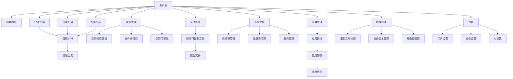
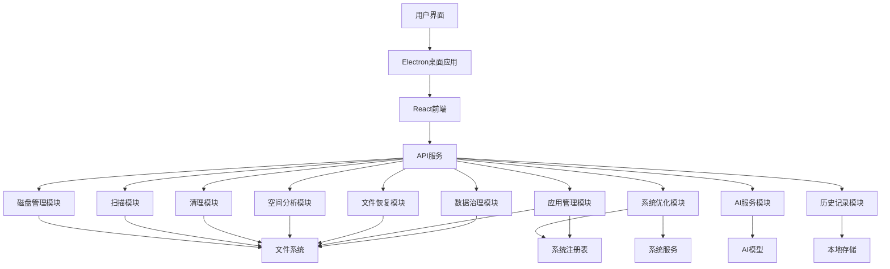

# CleanMaster Pro 产品需求文档

## 1. 产品概览

CleanMaster Pro 是一款专业的磁盘清理与系统优化工具，旨在帮助用户高效管理磁盘空间、提升系统性能。

- **核心价值**：通过智能扫描、深度清理、空间分析等功能，帮助用户释放磁盘空间、优化系统性能，提升电脑使用体验。
- **目标用户**：需要管理磁盘空间、优化系统性能的个人用户和企业用户，包括普通电脑用户、企业IT管理员、游戏玩家、开发者和内容创作者。
- **应用场景**：适用于Windows系统，可用于日常磁盘维护、系统优化、文件管理等场景。

## 2. 核心功能

### 2.1 功能模块

CleanMaster Pro 包含以下核心功能模块：

1. **磁盘管理**：获取磁盘信息、空间使用分析、多磁盘统一管理
2. **扫描功能**：快速扫描、深度扫描、智能分析、增量扫描
3. **清理执行**：执行清理操作、设置自动清理、批量清理
4. **空间管理**：空间使用情况分析、大文件识别、空间可视化
5. **文件恢复**：扫描可恢复文件、恢复已删除文件、文件预览
6. **系统优化**：启动项管理、注册表清理、系统服务优化
7. **清理历史**：查看清理历史记录、清理效果分析
8. **文件夹归类**：智能文件夹归类、文件整理建议、避免误删
9. **AI 服务**：文件分析、文件分类、文件名生成、清理建议、用户习惯学习
10. **数据治理**：文件元数据管理、重复文件检测、文件版本管理、数据结构优化
11. **应用程序管理**：应用扫描、应用卸载、残留文件清理、应用使用分析

### 2.2 页面详情

| 页面名称 | 模块名称 | 功能描述 |
|---------|---------|--------|
| 主页面 | 磁盘概览 | 展示所有磁盘的使用情况，包括总空间、已用空间、可用空间和使用百分比。 |
| 主页面 | 快速操作 | 提供快速扫描、深度扫描、智能分析等快捷操作按钮。 |
| 主页面 | 智能建议 | 基于AI分析，提供个性化的清理和优化建议。 |
| 扫描页面 | 快速扫描 | 执行快速扫描，识别临时文件、浏览器缓存等可清理项。 |
| 扫描页面 | 深度扫描 | 执行深度扫描，详细分析磁盘内容，提供更全面的清理建议。 |
| 扫描页面 | 智能分析 | 分析磁盘使用情况，生成使用频率分布和优化建议。 |
| 扫描页面 | 增量扫描 | 只扫描上次扫描后变化的文件，提高扫描速度。 |
| 清理页面 | 清理执行 | 根据扫描结果执行清理操作，删除选中的文件。 |
| 清理页面 | 自动清理 | 设置自动清理规则，包括定时执行和清理级别。 |
| 清理页面 | 批量清理 | 支持同时清理多个磁盘或文件夹。 |
| 空间管理页面 | 空间使用 | 展示磁盘空间使用情况，包括文件类型分布和大文件列表。 |
| 空间管理页面 | 文件夹归类 | 智能归类文件夹，提供文件整理建议。 |
| 空间管理页面 | 空间可视化 | 使用饼图、树状图等多种形式展示空间使用情况。 |
| 文件恢复页面 | 扫描恢复 | 扫描可恢复的已删除文件，支持文件预览和恢复。 |
| 系统优化页面 | 启动项管理 | 管理系统启动项，启用或禁用不必要的启动程序。 |
| 系统优化页面 | 注册表清理 | 清理无效的注册表项，优化系统性能。 |
| 系统优化页面 | 服务管理 | 管理系统服务，禁用不必要的服务。 |
| 应用管理页面 | 应用扫描 | 扫描系统中的应用程序，识别损坏、未完全卸载和沉睡的应用。 |
| 应用管理页面 | 应用卸载 | 卸载选中的应用程序，支持删除残留文件和注册表项。 |
| 应用管理页面 | 使用分析 | 分析应用使用频率，提供卸载建议。 |
| 数据治理页面 | 重复文件检测 | 检测系统中的重复文件，提供删除建议。 |
| 数据治理页面 | 文件版本管理 | 管理文件的多个版本，支持版本回溯。 |
| 数据治理页面 | 元数据管理 | 管理文件元数据，提高文件搜索和管理效率。 |
| 设置页面 | 用户设置 | 配置语言、主题、自动启动、默认清理级别等用户偏好。 |
| 设置页面 | 安全设置 | 配置文件删除确认、白名单管理等安全选项。 |
| 设置页面 | AI设置 | 配置AI服务参数和使用偏好。 |
| 历史页面 | 清理历史 | 查看历史清理记录，包括清理时间、清理类型、节省空间等信息。 |
| 历史页面 | 效果分析 | 分析清理效果，生成清理报告。 |

### 2.3 功能优先级

| 优先级 | 功能模块 | 具体功能 | 开发阶段 |
|--------|---------|----------|----------|
| P0 | 磁盘管理 | 磁盘信息获取、空间使用分析 | v1.0.0 |
| P0 | 扫描功能 | 快速扫描、深度扫描 | v1.0.0 |
| P0 | 清理执行 | 执行清理操作、自动清理 | v1.0.0 |
| P1 | 空间管理 | 空间使用分析、大文件识别 | v1.0.0 |
| P1 | 系统优化 | 启动项管理、注册表清理 | v1.0.0 |
| P1 | 清理历史 | 清理历史记录 | v1.0.0 |
| P2 | 文件恢复 | 扫描可恢复文件、恢复文件 | v1.1.0 |
| P2 | 应用管理 | 应用扫描、应用卸载 | v1.1.0 |
| P2 | 文件夹归类 | 智能文件夹归类 | v1.1.0 |
| P3 | AI服务 | 文件分析、清理建议 | v1.2.0 |
| P3 | 数据治理 | 重复文件检测、文件版本管理 | v1.2.0 |
| P3 | 空间可视化 | 多种空间可视化形式 | v1.2.0 |
| P4 | 跨平台支持 | 支持其他操作系统 | v2.0.0 |

## 3. Core Process

### 用户主要操作流程

**1. 首次使用流程**
1. 用户打开CleanMaster Pro应用
2. 系统自动扫描磁盘信息，展示磁盘概览
3. 用户选择快速扫描或深度扫描
4. 扫描完成后，展示可清理项和AI建议
5. 用户确认清理操作
6. 系统执行清理，显示清理结果
7. 用户可查看清理历史

**2. 日常维护流程**
1. 用户打开CleanMaster Pro应用
2. 查看磁盘概览，了解空间使用情况
3. 执行快速扫描或增量扫描，检查可清理项
4. 根据AI建议执行清理
5. 查看清理历史，确认清理效果

**3. 系统优化流程**
1. 用户进入系统优化页面
2. 管理启动项，禁用不必要的启动程序
3. 执行注册表清理
4. 管理系统服务
5. 查看优化结果

**4. 应用管理流程**
1. 用户进入应用管理页面
2. 执行应用扫描，识别问题应用
3. 根据AI建议卸载不需要的应用
4. 清理应用残留文件和注册表项
5. 查看清理效果

**5. 数据治理流程**
1. 用户进入数据治理页面
2. 执行重复文件检测
3. 查看文件版本管理
4. 优化文件结构
5. 查看治理效果

### 3.1 用户旅程图

| 阶段 | 用户行为 | 系统响应 | 情感 | 痛点 | 机会 |
|------|----------|----------|------|------|------|
| 发现 | 发现磁盘空间不足 | 系统通知 | 担忧 | 空间不足影响使用 | 提供解决方案 |
| 首次使用 | 打开应用，查看磁盘概览 | 自动扫描，展示结果 | 期待 | 操作复杂 | 简化操作流程 |
| 扫描 | 执行扫描 | 显示扫描进度和结果 | 专注 | 扫描速度慢 | 优化扫描算法 |
| 清理 | 确认清理操作 | 执行清理，显示结果 | 满意 | 担心误删 | 提供安全保障 |
| 优化 | 执行系统优化 | 显示优化结果 | 惊喜 | 系统卡顿 | 提升系统性能 |
| 管理 | 管理应用和文件 | 提供智能建议 | 轻松 | 文件管理混乱 | 智能归类和治理 |
| 维护 | 定期维护 | 自动执行清理 | 放心 | 忘记维护 | 自动清理功能 |

## 4. 用户接口设计

### 4.1 设计风格

- **主色调**：蓝色系（#1E88E5），代表专业、可靠
- **辅助色**：绿色（#4CAF50）用于成功操作，红色（#F44336）用于警告和错误，橙色（#FF9800）用于提示
- **中性色**：白色（#FFFFFF）背景，深灰色（#333333）文字，浅灰色（#F5F5F5）分隔线
- **按钮风格**：圆角矩形按钮，有轻微的阴影效果，悬停时有平滑过渡
- **字体**：系统默认字体，标题使用16-18px，正文使用14px，辅助文字使用12px
- **布局**：左侧导航栏，右侧内容区，顶部状态栏，底部状态栏
- **图标**：使用扁平化图标，风格统一，支持暗色模式
- **动效**：平滑的过渡动画，提升用户体验

### 4.2 页面设计概览

| 页面名称 | 模块名称 | UI元素 |
|---------|---------|--------|
| 主页面 | 磁盘概览 | 卡片式布局，展示每个磁盘的使用情况，使用进度条直观显示空间占用，颜色从绿色（充足）到红色（不足）渐变。支持点击进入详情。 |
| 主页面 | 快速操作 | 大型按钮，带有图标和文字，排列在磁盘概览下方，方便用户快速访问核心功能。按钮有悬停效果。 |
| 主页面 | 智能建议 | 卡片式布局，基于AI分析提供个性化建议，支持一键执行。 |
| 扫描页面 | 扫描进度 | 进度条显示扫描进度，实时更新已扫描文件数和发现的可清理空间。支持暂停和取消操作。 |
| 扫描页面 | 扫描结果 | 列表形式展示可清理项，按类型分组，显示每个类型的大小和占比，支持勾选选择。提供详细信息查看。 |
| 清理页面 | 清理确认 | 模态弹窗确认清理操作，显示预计节省空间和删除文件数，提供确认和取消按钮。 |
| 清理页面 | 清理结果 | 清理完成后显示成功页面，展示实际节省空间和删除文件数，提供查看详情和返回按钮。 |
| 空间管理页面 | 空间使用 | 饼图展示文件类型分布，列表展示大文件，支持排序和筛选。提供文件预览功能。 |
| 空间管理页面 | 空间可视化 | 提供饼图、树状图、热力图等多种可视化形式，支持交互操作。 |
| 系统优化页面 | 启动项管理 | 列表展示启动项，每个项包含名称、状态、路径，支持一键启用/禁用。提供详细信息和建议。 |
| 应用管理页面 | 应用列表 | 卡片式布局展示应用，包含应用名称、版本、状态、建议操作，支持批量选择和操作。 |
| 数据治理页面 | 重复文件检测 | 列表展示重复文件，支持预览和删除操作。提供智能去重建议。 |
| 设置页面 | 用户设置 | 表单形式展示各项设置，使用开关、下拉菜单、输入框等控件，支持实时保存。提供默认设置重置功能。 |

### 4.3 自适应

- **桌面端优先**：主要针对桌面端设计，支持Windows 10及以上版本
- **响应式布局**：适配不同屏幕尺寸，在小屏幕上自动调整布局
- **高DPI支持**：支持高分辨率显示器，确保界面清晰锐利
- **键盘导航**：支持键盘快捷键操作，提升用户体验
- **无障碍支持**：符合无障碍标准，支持屏幕阅读器
- **暗色模式**：支持亮色和暗色主题，根据系统设置自动切换

## 5. 技术架构

### 5.1 技术栈

- **前端**：React 18+、TypeScript 5+、Tailwind CSS 3+、React Router 6+
- **后端**：Node.js 18+、Express 4+
- **桌面应用**：Electron 20+（替代WPF，提供跨平台能力）
- **API**：RESTful API
- **数据存储**：本地文件系统、JSON配置文件、SQLite（用于存储清理历史和应用数据）
- **AI服务**：集成阿里通义千问等AI模型，提供智能分析和建议
- **状态管理**：React Context API + useReducer（轻量级状态管理）
- **图表库**：Chart.js（空间可视化）
- **HTTP客户端**：Axios（API调用）

### 5.2 系统架构

### 5.3 关键技术点

- **磁盘扫描**：使用高效的文件系统遍历算法，支持增量扫描，快速识别可清理文件
- **空间分析**：使用树状结构分析磁盘空间使用情况，生成直观的空间分布报告
- **文件恢复**：基于文件系统原理，扫描已删除文件的痕迹，支持文件恢复
- **启动项管理**：通过系统API管理启动项，优化系统启动速度
- **注册表清理**：安全地清理无效注册表项，避免系统问题
- **应用管理**：深度扫描应用程序，识别损坏、未完全卸载和沉睡的应用
- **AI集成**：使用AI模型进行文件分析、分类和清理建议，提升用户体验
- **跨平台**：使用Electron，支持未来扩展到其他平台
- **性能优化**：使用Web Workers处理密集型任务，避免UI阻塞
- **安全保障**：建立文件删除白名单和黑名单机制，避免误删重要文件

## 6. 数据模型

### 6.1 核心数据结构

**1. 磁盘信息 (Disk)**
- letter: string - 盘符，如 "C:"
- name: string - 磁盘名称，如 "系统盘"
- totalSpace: number - 总空间（字节）
- usedSpace: number - 已用空间（字节）
- freeSpace: number - 可用空间（字节）
- percentage: number - 使用百分比（0-100）
- fileSystem: string - 文件系统类型，如 "NTFS"
- healthStatus: 'healthy' | 'warning' | 'critical' - 健康状态

**2. 用户设置 (Settings)**
- language: 'zh-CN' | 'en-US' - 语言
- theme: 'light' | 'dark' | 'system' - 主题
- autoStart: boolean - 自动启动
- defaultCleanLevel: 'quick' | 'standard' | 'deep' - 默认清理级别
- historyRetention: number - 历史保留天数
- autoCleanEnabled: boolean - 自动清理启用状态
- autoCleanSchedule: string - 自动清理计划（cron表达式）
- scanTimeout: number - 扫描超时时间（分钟）
- maxHistoryItems: number - 最大历史记录数
- aiEnabled: boolean - AI功能启用状态
- aiModel: string - AI模型选择
- safetyLevel: 'low' | 'medium' | 'high' - 安全级别

**3. 扫描结果 (ScanResult)**
- scanId: string - 扫描ID
- timestamp: string - 扫描时间
- disk: string - 扫描的磁盘
- totalSpace: number - 总空间
- usedSpace: number - 已用空间
- cleanableSpace: number - 可清理空间
- fileTypes: FileType[] - 文件类型分布
- files?: FileInfo[] - 详细文件列表（深度扫描）
- scanType: 'quick' | 'deep' | 'incremental' - 扫描类型
- duration: number - 扫描持续时间（秒）

**4. 应用程序信息 (Application)**
- id: string - 应用ID
- name: string - 应用名称
- displayName: string - 显示名称
- version: string - 版本号
- publisher: string - 发布者
- installDate: string - 安装日期（ISO 8601）
- installLocation: string - 安装路径
- size: number - 占用空间（字节）
- lastUsedTime?: string - 最后使用时间
- usageCount: number - 使用次数
- status: 'healthy' | 'broken' | 'incomplete' | 'dormant' | 'unknown' - 健康状态
- statusReason: string - 状态原因描述
- recommendation: 'keep' | 'remove' | 'review' - 清理建议
- recommendationReason: string - 建议原因
- confidence: number - 建议置信度（0-100）
- residualFiles?: ResidualFile[] - 残留文件
- registryEntries?: RegistryEntry[] - 注册表项

**5. 清理历史 (CleanHistory)**
- id: string - 记录ID
- timestamp: string - 清理时间
- disk: string - 清理的磁盘
- cleanType: 'quick' | 'standard' | 'deep' | 'auto' - 清理类型
- spaceSaved: number - 节省空间（字节）
- filesDeleted: number - 删除文件数
- duration: number - 清理持续时间（秒）
- scanId?: string - 关联的扫描ID

**6. 空间使用 (SpaceUsage)**
- disk: string - 磁盘
- totalSpace: number - 总空间
- usedSpace: number - 已用空间
- freeSpace: number - 可用空间
- fileTypes: FileType[] - 文件类型分布
- largeFiles: LargeFile[] - 大文件列表
- topDirectories: DirectoryInfo[] - 占用空间最多的目录

## 7. 部署与集成

### 7.1 部署方式

- **桌面应用**：通过安装包（.exe）安装到Windows系统，支持静默安装和自定义安装
- **后端服务**：作为Electron应用的内置服务运行，无需独立部署
- **更新机制**：支持自动检查更新、手动更新和增量更新
- **便携式版本**：提供绿色版，无需安装即可运行

### 7.2 集成点

- **系统集成**：与Windows系统深度集成，支持系统启动、注册表管理等操作
- **文件系统集成**：直接访问和管理文件系统，执行文件操作
- **AI服务集成**：集成阿里通义千问等AI模型，提供智能分析和建议
- **云服务集成**：未来可集成云存储服务，实现跨设备文件管理

### 7.3 系统要求

- **操作系统**：Windows 7 SP1及以上版本
- **CPU**：1 GHz或更快的处理器
- **内存**：2 GB RAM或更多
- **磁盘空间**：100 MB可用空间
- **网络连接**：用于AI服务和更新检查（可选）
- **权限**：部分功能需要管理员权限

## 8. 质量保障

### 8.1 测试策略

- **功能测试**：测试所有核心功能，确保功能正常运行
- **性能测试**：测试扫描速度、清理效率、内存占用等性能指标
- **兼容性测试**：测试在不同Windows版本和硬件配置上的兼容性
- **安全测试**：测试文件操作、注册表修改等安全相关功能
- **用户体验测试**：测试界面易用性、操作流畅度、响应时间等
- **回归测试**：确保新功能不会破坏现有功能
- **自动化测试**：使用Jest和Cypress进行自动化测试

### 8.2 安全考虑

- **文件操作安全**：在执行文件删除操作前进行确认，避免误操作
- **注册表操作安全**：只清理经过验证的无效注册表项，避免系统问题
- **数据保护**：不收集用户个人数据，所有操作在本地执行
- **权限管理**：需要管理员权限时，明确提示用户并获取授权
- **白名单机制**：建立系统文件和重要文件的白名单，避免误删
- **备份机制**：重要操作前自动创建备份，支持恢复
- **AI数据处理**：AI分析在本地执行，保护用户隐私

### 8.3 非功能性需求

- **性能**：快速扫描<30秒，深度扫描<3分钟，清理操作<1分钟
- **可靠性**：应用崩溃率<0.1%，文件操作成功率>99.9%
- **可用性**：界面响应时间<0.5秒，操作流畅无卡顿
- **可扩展性**：支持插件系统，便于功能扩展
- **可维护性**：代码结构清晰，文档完整，易于维护

## 9. 项目计划

### 9.1 开发阶段

1. **需求分析与设计**：确定产品需求，设计系统架构和界面
2. **核心功能开发**：实现磁盘管理、扫描、清理等核心功能
3. **扩展功能开发**：实现文件恢复、系统优化、应用管理等扩展功能
4. **AI集成**：集成AI模型，提供智能分析和建议
5. **测试与优化**：进行全面测试，优化性能和用户体验
6. **发布与更新**：发布正式版本，持续更新和改进

### 9.2 里程碑

- **v1.0.0**：实现核心功能，包括磁盘管理、扫描、清理、空间管理、系统优化和清理历史
- **v1.1.0**：添加应用程序管理、文件恢复和文件夹归类功能
- **v1.2.0**：集成AI服务，添加数据治理和空间可视化功能
- **v1.3.0**：优化性能和用户体验，添加高级设置和自定义选项
- **v2.0.0**：实现跨平台支持，扩展到macOS和Linux

### 9.3 开发团队

- **产品经理**：负责产品规划和需求管理
- **前端开发**：负责React前端和Electron桌面应用开发
- **后端开发**：负责Node.js后端和系统API集成
- **AI工程师**：负责AI模型集成和智能分析功能
- **测试工程师**：负责功能测试和质量保障
- **UI/UX设计师**：负责界面设计和用户体验优化

## 10. 附录

### 10.1 术语定义

- **磁盘清理**：删除临时文件、缓存文件等不需要的文件，释放磁盘空间
- **深度扫描**：全面扫描磁盘，识别更多可清理项
- **智能分析**：使用AI技术分析磁盘使用情况，提供个性化清理建议
- **启动项**：系统启动时自动运行的程序
- **注册表**：Windows系统用于存储配置信息的数据库
- **残留文件**：应用程序卸载后留下的文件和注册表项
- **沉睡应用**：长时间未使用的应用程序
- **增量扫描**：只扫描上次扫描后变化的文件，提高扫描速度
- **数据治理**：对文件数据进行管理和优化，提高文件组织效率

### 10.2 参考文档

- **API文档**：api.md - 详细的API接口定义
- **后端服务文档**：README.md - 后端服务的基本信息
- **前端代码**：src/react/ - 前端应用代码
- **桌面应用代码**：src/CleanMasterPro/ - 桌面应用代码
- **需求研究报告**：智能磁盘清理与数据治理工具需求研究报告.md - 市场和用户需求分析

### 10.3 联系方式

- **产品经理**：[产品经理姓名]
- **开发团队**：[开发团队名称]
- **技术支持**：[技术支持邮箱/电话]
- **反馈渠道**：[反馈邮箱/网站]

---

**文档版本**：v1.2.0
**最后更新**：2026-04-11
**文档维护**：CleanMaster Pro 开发团队