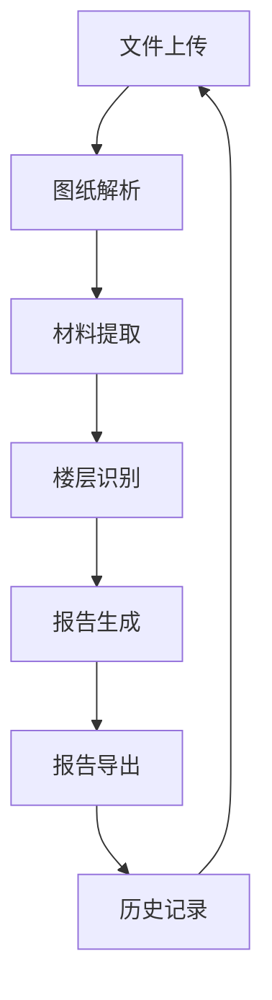

# 检验批容量与隐蔽工程报告生成工具

## 1. 产品概述

### 1.1 产品背景

在医疗净化工程等建筑项目中，检验批容量和隐蔽工程报告的编制是一项繁琐但重要的工作。传统的手工编制方式效率低下，容易出错，且难以保证数据的准确性和一致性。因此，需要开发一个智能工具，能够自动从图纸中提取材料信息，生成规范的检验批容量和隐蔽工程报告。

### 1.2 产品目标

开发一个轻量级应用，能够：
- 自动解析DWG、DXF等格式的工程图纸
- 智能提取材料名称、型号、数量等信息
- 识别楼层信息，按楼层组织报告
- 生成规范的检验批容量和隐蔽工程报告
- 支持多种输出格式，如Markdown、HTML、Excel等
- 提供直观的用户界面，方便操作和配置

### 1.3 目标用户

- 建筑工程施工管理人员
- 工程质量检验人员
- 医疗净化工程专业人员
- 需要编制检验批容量和隐蔽工程报告的相关人员

## 2. 核心功能

### 2.1 图纸解析

- **支持文件格式**：DWG、DXF、PDF
- **批量处理**：支持多文件批量处理
- **文件预览**：提供图纸预览功能
- **错误处理**：处理文件解析错误，提供友好的错误提示

### 2.2 材料提取

- **智能识别**：识别材料名称、型号、数量
- **材质识别**：正确识别材料材质，如304不锈钢等
- **型号识别**：准确识别材料型号，避免将长度单位误识别为型号
- **数量提取**：提取材料数量及单位
- **位置提取**：提取材料在图纸中的位置信息

### 2.3 楼层识别

- **自动识别**：从图纸名称和内容中自动识别楼层信息
- **楼层分类**：按楼层组织材料和报告
- **支持多层**：支持多层建筑，包括夹层等特殊楼层

### 2.4 报告生成

- **报告类型**：检验批容量报告、隐蔽工程报告
- **输出格式**：Markdown、HTML、Excel
- **报告模板**：提供标准报告模板，支持自定义模板
- **数据汇总**：自动汇总检验批容量数据
- **标准规范**：自动添加相关标准规范信息

### 2.5 用户配置

- **提取规则**：允许用户调整材料提取规则
- **报告模板**：支持用户自定义报告模板
- **输出设置**：配置输出格式和路径
- **历史记录**：保存历史处理结果，方便查询和对比

## 3. 核心流程

### 3.1 主流程

1. **文件上传**：用户上传图纸文件或目录
2. **图纸解析**：系统解析图纸文件，提取文字和图形信息
3. **材料提取**：智能识别材料名称、型号、数量等信息
4. **楼层识别**：识别楼层信息，按楼层组织材料
5. **报告生成**：生成检验批容量和隐蔽工程报告
6. **报告导出**：导出报告为指定格式

### 3.2 详细流程



## 4. 用户界面设计

### 4.1 布局设计

- **顶部导航栏**：包含文件上传、报告生成、配置等功能按钮
- **左侧面板**：文件列表、历史记录
- **右侧面板**：图纸预览、报告预览
- **底部状态栏**：显示处理状态、进度等信息

### 4.2 主要页面

1. **首页**：文件上传区域，显示最近处理的文件和报告
2. **文件处理页**：显示文件列表，提供批量处理功能
3. **报告预览页**：预览生成的报告，支持导出功能
4. **配置页**：调整提取规则、报告模板等设置
5. **历史记录页**：查看历史处理结果，支持重新处理

### 4.3 交互设计

- **拖拽上传**：支持拖拽文件到应用窗口进行上传
- **实时预览**：处理过程中实时显示进度和结果
- **批量操作**：支持多选文件进行批量处理
- **快捷操作**：提供常用操作的快捷按钮
- **错误提示**：处理错误时提供友好的错误提示

## 5. 技术方案

### 5.1 技术栈

- **后端**：Python + Flask
- **前端**：Vue.js + Electron
- **文件解析**：ezdxf (DWG/DXF)、PyPDF2 (PDF)
- **数据存储**：SQLite (本地存储)
- **打包**：PyInstaller + Electron Builder

### 5.2 核心模块

1. **文件解析模块**：负责解析不同格式的图纸文件
2. **材料提取模块**：智能识别材料信息
3. **楼层识别模块**：识别楼层信息并组织材料
4. **报告生成模块**：生成规范的报告
5. **用户界面模块**：提供直观的用户界面

### 5.3 性能优化

- **多线程处理**：使用多线程提高处理速度
- **缓存机制**：缓存解析结果，避免重复处理
- **增量处理**：只处理变化的部分
- **内存管理**：优化内存使用，支持处理大型图纸

## 6. 数据结构

### 6.1 材料信息

```json
{
  "name": "304金属钢管",
  "model": "DN50",
  "quantity": "10m",
  "position": "图中未知区域",
  "floor": "三层",
  "drawing_number": "水施-03",
  "drawing_name": "三层排水系统"
}
```

### 6.2 报告信息

```json
{
  "project_name": "东方肝胆医院医疗净化工程",
  "generated_at": "2026-04-14 10:00:00",
  "floors": [
    {
      "floor": "三层",
      "drawings": [
        {
          "drawing_number": "水施-03",
          "drawing_name": "三层排水系统",
          "materials": [/* 材料信息 */],
          "inspection_batches": [/* 检验批信息 */]
        }
      ]
    }
  ],
  "total_materials": 40,
  "total_inspection_batches": 33
}
```

## 7. 部署方案

### 7.1 打包发布

- **Windows**：生成.exe安装包
- **MacOS**：生成.dmg安装包
- **Linux**：生成.deb和.rpm安装包

### 7.2 更新机制

- **自动检查更新**：定期检查新版本
- **增量更新**：只更新变化的部分
- **手动更新**：提供手动更新选项

### 7.3 系统要求

- **Windows**：Windows 10及以上
- **MacOS**：macOS 10.15及以上
- **Linux**：Ubuntu 20.04及以上
- **内存**：4GB及以上
- **处理器**：Intel i5及以上

## 8. 风险与应对

### 8.1 技术风险

- **图纸格式兼容性**：不同版本的CAD软件生成的图纸格式可能不同
  - 应对：使用兼容多种版本的解析库，提供格式转换功能

- **材料识别准确性**：复杂图纸中的材料信息可能难以准确识别
  - 应对：使用机器学习算法提高识别准确率，提供人工修正功能

- **性能问题**：大型图纸可能导致处理速度慢
  - 应对：优化算法，使用多线程处理，提供进度显示

### 8.2 业务风险

- **标准规范变更**：建筑工程标准规范可能更新
  - 应对：提供标准规范更新机制，定期更新内置标准

- **用户操作错误**：用户可能上传错误的文件或设置错误的参数
  - 应对：提供文件格式检查，参数验证，友好的错误提示

- **数据安全**：图纸和报告可能包含敏感信息
  - 应对：本地处理，不上传数据，提供数据加密功能

## 9. 项目计划

### 9.1 开发阶段

1. **需求分析与设计**：2周
2. **后端开发**：4周
3. **前端开发**：4周
4. **集成测试**：2周
5. **打包发布**：1周

### 9.2 里程碑

- **M1**：完成需求分析与设计
- **M2**：完成后端核心功能开发
- **M3**：完成前端界面开发
- **M4**：完成集成测试
- **M5**：发布第一个版本

## 10. 结论

本产品旨在解决医疗净化工程等建筑项目中检验批容量和隐蔽工程报告编制的问题，通过智能解析图纸、提取材料信息、生成规范报告，提高工作效率和准确性。产品采用轻量级架构，支持离线运行，提供直观的用户界面，满足用户的实际需求。

通过本产品，用户可以：
- 快速处理大量图纸，提取材料信息
- 准确生成检验批容量和隐蔽工程报告
- 按楼层组织报告，提高报告的可读性
- 支持多种输出格式，满足不同场景的需求
- 自定义配置，适应不同项目的要求

本产品具有良好的扩展性和可维护性，可根据用户反馈和需求变化进行持续优化和更新。