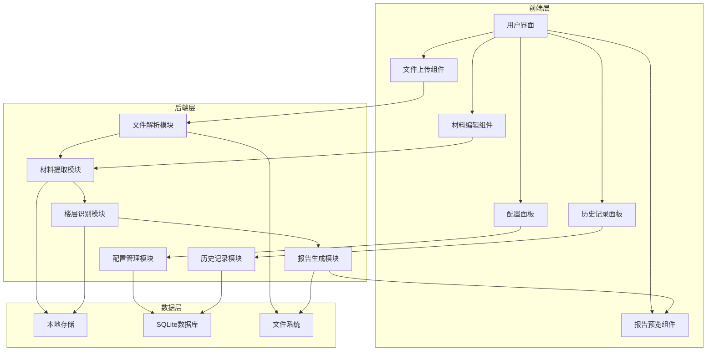

# 检验批容量与隐蔽工程报告生成工具 - 技术文档

## 1. 系统架构

### 1.1 架构概述

本系统采用前后端分离的架构设计，使用Python作为后端语言，Vue.js作为前端框架，Electron作为桌面应用容器。系统分为以下几个核心模块：

- **文件解析模块**：负责解析DWG、DXF、PDF等格式的图纸文件
- **材料提取模块**：智能识别材料名称、型号、数量等信息
- **楼层识别模块**：识别楼层信息并按楼层组织材料
- **报告生成模块**：生成检验批容量和隐蔽工程报告
- **用户界面模块**：提供直观的用户界面，处理用户交互
- **配置管理模块**：管理用户配置和偏好设置
- **历史记录模块**：保存和管理历史处理结果

### 1.2 系统架构图



## 2. 技术选型

### 2.1 后端技术

| 技术 | 版本 | 用途 | 选型理由 |
|------|------|------|----------|
| Python | 3.9+ | 后端开发 | 强大的文件处理能力，丰富的第三方库支持 |
| Flask | 2.0+ | Web框架 | 轻量级，易于集成，适合桌面应用 |
| ezdxf | 1.0+ | DWG/DXF解析 | 专门用于解析AutoCAD文件，支持多种版本 |
| PyPDF2 | 2.0+ | PDF解析 | 用于解析PDF格式的图纸文件 |
| SQLite | 3.35+ | 本地存储 | 轻量级，无需独立服务器，适合桌面应用 |
| NumPy | 1.20+ | 数据处理 | 用于处理和分析材料数据 |
| Pandas | 1.3+ | 数据处理 | 用于数据汇总和报告生成 |

### 2.2 前端技术

| 技术 | 版本 | 用途 | 选型理由 |
|------|------|------|----------|
| Vue.js | 3.0+ | 前端框架 | 响应式设计，组件化开发，易于维护 |
| Electron | 16.0+ | 桌面应用容器 | 跨平台支持，原生应用体验 |
| Element Plus | 2.0+ | UI组件库 | 丰富的组件，美观的界面 |
| ECharts | 5.0+ | 数据可视化 | 强大的图表功能，用于数据展示 |
| Axios | 0.27+ | HTTP客户端 | 用于与后端API通信 |
| Vue Router | 4.0+ | 路由管理 | 管理应用内导航 |
| Pinia | 2.0+ | 状态管理 | 管理应用状态，替代Vuex |

### 2.3 开发工具

| 工具 | 用途 |
|------|------|
| Visual Studio Code | 代码编辑器 |
| PyCharm | Python开发 |
| npm/yarn | 前端包管理 |
| PyInstaller | Python打包 |
| Electron Builder | Electron打包 |
| Git | 版本控制 |

## 3. 核心模块设计

### 3.1 文件解析模块

#### 3.1.1 功能描述
- 解析DWG、DXF、PDF等格式的图纸文件
- 提取图纸中的文字和图形信息
- 支持批量处理多个文件
- 处理文件解析错误，提供友好的错误提示

#### 3.1.2 实现方案
- 使用ezdxf库解析DWG/DXF文件
- 使用PyPDF2库解析PDF文件
- 实现文件格式检测，自动选择合适的解析器
- 采用多线程处理，提高批量处理效率

#### 3.1.3 关键类和方法

| 类/方法 | 说明 | 参数 | 返回值 |
|---------|------|------|--------|
| `FileParser` | 文件解析主类 | - | - |
| `FileParser.parse()` | 解析文件 | file_path: str | `{texts: list, notes: list, drawing_info: dict}` |
| `FileParser.parse_dwg()` | 解析DWG/DXF文件 | file_path: str | `{texts: list, notes: list, drawing_info: dict}` |
| `FileParser.parse_pdf()` | 解析PDF文件 | file_path: str | `{texts: list, notes: list, drawing_info: dict}` |
| `FileParser.batch_parse()` | 批量解析文件 | file_paths: list | `[{file_path: str, result: dict, error: str}]` |

### 3.2 材料提取模块

#### 3.2.1 功能描述
- 从图纸文字中智能识别材料名称、型号、数量
- 正确识别材料材质，如304不锈钢等
- 准确识别材料型号，避免将长度单位误识别为型号
- 提取材料数量及单位，支持多种单位类型
- 提取材料在图纸中的位置信息

#### 3.2.2 实现方案
- 使用正则表达式和规则引擎提取材料信息
- 建立材料关键词库，支持多种材料类型
- 实现材质和型号的正确识别逻辑
- 支持用户自定义提取规则

#### 3.2.3 关键类和方法

| 类/方法 | 说明 | 参数 | 返回值 |
|---------|------|------|--------|
| `MaterialExtractor` | 材料提取主类 | - | - |
| `MaterialExtractor.extract()` | 提取材料信息 | texts: list, notes: list | `[material_dict]` |
| `MaterialExtractor.extract_material_name()` | 提取材料名称 | text: str | `str` |
| `MaterialExtractor.extract_model()` | 提取材料型号 | text: str | `str` |
| `MaterialExtractor.extract_quantity()` | 提取材料数量 | text: str | `{value: float, unit: str}` |
| `MaterialExtractor.extract_position()` | 提取材料位置 | text: str | `str` |

### 3.3 楼层识别模块

#### 3.3.1 功能描述
- 从图纸名称和内容中自动识别楼层信息
- 按楼层组织材料和报告
- 支持多层建筑，包括夹层等特殊楼层

#### 3.3.2 实现方案
- 建立楼层关键词库，识别不同表示方式的楼层
- 从图纸名称和内容中提取楼层信息
- 实现楼层信息的标准化处理
- 按楼层组织材料数据

#### 3.3.3 关键类和方法

| 类/方法 | 说明 | 参数 | 返回值 |
|---------|------|------|--------|
| `FloorIdentifier` | 楼层识别主类 | - | - |
| `FloorIdentifier.identify()` | 识别楼层信息 | drawing_name: str, texts: list | `str` |
| `FloorIdentifier.organize_by_floor()` | 按楼层组织材料 | materials: list | `{floor: [materials]}` |
| `FloorIdentifier.normalize_floor()` | 标准化楼层表示 | floor: str | `str` |

### 3.4 报告生成模块

#### 3.4.1 功能描述
- 生成检验批容量报告和隐蔽工程报告
- 支持Markdown、HTML、Excel等多种输出格式
- 自动汇总检验批容量数据，计算k值
- 自动添加相关标准规范信息
- 按楼层组织报告内容

#### 3.4.2 实现方案
- 实现报告模板系统，支持标准模板和自定义模板
- 使用Pandas处理和汇总数据
- 实现不同格式的报告生成器
- 支持报告预览和导出

#### 3.4.3 关键类和方法

| 类/方法 | 说明 | 参数 | 返回值 |
|---------|------|------|--------|
| `ReportGenerator` | 报告生成主类 | - | - |
| `ReportGenerator.generate()` | 生成报告 | data: dict, format: str | `{content: str, file_path: str}` |
| `ReportGenerator.generate_markdown()` | 生成Markdown报告 | data: dict | `str` |
| `ReportGenerator.generate_html()` | 生成HTML报告 | data: dict | `str` |
| `ReportGenerator.generate_excel()` | 生成Excel报告 | data: dict | `str` |
| `ReportGenerator.calculate_k_value()` | 计算k值 | quantity: float, unit: str | `float` |

### 3.5 配置管理模块

#### 3.5.1 功能描述
- 管理用户配置和偏好设置
- 支持用户自定义材料提取规则
- 支持用户自定义报告模板
- 保存用户偏好设置，如默认输出格式、默认模板等

#### 3.5.2 实现方案
- 使用SQLite存储配置数据
- 实现配置的序列化和反序列化
- 提供配置的增删改查接口
- 支持配置的导入和导出

#### 3.5.3 关键类和方法

| 类/方法 | 说明 | 参数 | 返回值 |
|---------|------|------|--------|
| `ConfigManager` | 配置管理主类 | - | - |
| `ConfigManager.get_config()` | 获取配置 | key: str | `dict` |
| `ConfigManager.set_config()` | 设置配置 | key: str, value: dict | `bool` |
| `ConfigManager.add_material_keyword()` | 添加材料关键词 | keyword: str, category: str | `bool` |
| `ConfigManager.add_report_template()` | 添加报告模板 | name: str, content: str | `bool` |
| `ConfigManager.export_config()` | 导出配置 | file_path: str | `bool` |
| `ConfigManager.import_config()` | 导入配置 | file_path: str | `bool` |

### 3.6 历史记录模块

#### 3.6.1 功能描述
- 保存历史处理结果，方便查询和对比
- 支持历史记录的管理和维护
- 支持重新处理历史文件

#### 3.6.2 实现方案
- 使用SQLite存储历史记录
- 实现历史记录的增删改查接口
- 支持历史记录的搜索和过滤
- 支持历史报告的预览和重新生成

#### 3.6.3 关键类和方法

| 类/方法 | 说明 | 参数 | 返回值 |
|---------|------|------|--------|
| `HistoryManager` | 历史记录管理主类 | - | - |
| `HistoryManager.add_record()` | 添加历史记录 | record: dict | `int` |
| `HistoryManager.get_records()` | 获取历史记录 | filters: dict | `[record_dict]` |
| `HistoryManager.get_record()` | 获取单个历史记录 | id: int | `record_dict` |
| `HistoryManager.delete_record()` | 删除历史记录 | id: int | `bool` |
| `HistoryManager.reprocess()` | 重新处理历史文件 | id: int | `{success: bool, report_path: str}` |

## 4. 数据结构设计

### 4.1 材料信息

```python
class Material:
    def __init__(self, id, name, model, quantity, unit, position, floor, drawing_number, drawing_name, category, inspection_batch, standard):
        self.id = id  # 唯一标识符
        self.name = name  # 材料名称
        self.model = model  # 材料型号
        self.quantity = quantity  # 材料数量
        self.unit = unit  # 单位
        self.position = position  # 位置
        self.floor = floor  # 楼层
        self.drawing_number = drawing_number  # 图纸号
        self.drawing_name = drawing_name  # 图纸名称
        self.category = category  # 工程领域分类
        self.inspection_batch = inspection_batch  # 检验批项目
        self.standard = standard  # 标准规范
```

### 4.2 报告信息

```python
class Report:
    def __init__(self, id, project_name, generated_at, floors, total_materials, total_inspection_batches, output_format, file_path):
        self.id = id  # 唯一标识符
        self.project_name = project_name  # 项目名称
        self.generated_at = generated_at  # 生成时间
        self.floors = floors  # 楼层信息，包含图纸和材料
        self.total_materials = total_materials  # 总材料数
        self.total_inspection_batches = total_inspection_batches  # 总检验批数
        self.output_format = output_format  # 输出格式
        self.file_path = file_path  # 报告文件路径
```

### 4.3 用户配置

```python
class Config:
    def __init__(self, id, user_preferences, extraction_rules, report_templates):
        self.id = id  # 唯一标识符
        self.user_preferences = user_preferences  # 用户偏好设置
        self.extraction_rules = extraction_rules  # 提取规则
        self.report_templates = report_templates  # 报告模板
```

### 4.4 历史记录

```python
class HistoryRecord:
    def __init__(self, id, file_paths, processed_at, materials_count, report_path, status):
        self.id = id  # 唯一标识符
        self.file_paths = file_paths  # 处理的文件路径
        self.processed_at = processed_at  # 处理时间
        self.materials_count = materials_count  # 提取的材料数量
        self.report_path = report_path  # 生成的报告路径
        self.status = status  # 处理状态
```

## 5. API设计

### 5.1 后端API

| API路径 | 方法 | 功能 | 请求参数 | 成功响应 |
|---------|------|------|----------|----------|
| `/api/parse` | POST | 解析文件 | `{file_paths: [str]}` | `{success: true, data: [{file_path: str, texts: [str], notes: [str], drawing_info: {}}]}` |
| `/api/extract` | POST | 提取材料 | `{texts: [str], notes: [str]}` | `{success: true, data: [{name: str, model: str, quantity: str, unit: str, position: str}]}` |
| `/api/generate` | POST | 生成报告 | `{data: {}, format: str}` | `{success: true, data: {content: str, file_path: str}}` |
| `/api/config` | GET | 获取配置 | `{key: str}` | `{success: true, data: {}}` |
| `/api/config` | POST | 设置配置 | `{key: str, value: {}}` | `{success: true}` |
| `/api/history` | GET | 获取历史记录 | `{filters: {}}` | `{success: true, data: [{id: int, file_paths: [str], processed_at: str, materials_count: int, report_path: str, status: str}]}` |
| `/api/history` | POST | 添加历史记录 | `{record: {}}` | `{success: true, data: {id: int}}` |
| `/api/history/{id}` | GET | 获取单个历史记录 | `{id: int}` | `{success: true, data: {}}` |
| `/api/history/{id}` | DELETE | 删除历史记录 | `{id: int}` | `{success: true}` |
| `/api/history/{id}/reprocess` | POST | 重新处理历史文件 | `{id: int}` | `{success: true, data: {report_path: str}}` |

### 5.2 前端API调用

| 方法 | 功能 | 参数 | 返回值 |
|------|------|------|--------|
| `parseFiles()` | 解析文件 | filePaths: array | Promise<{success, data}> |
| `extractMaterials()` | 提取材料 | texts: array, notes: array | Promise<{success, data}> |
| `generateReport()` | 生成报告 | data: object, format: string | Promise<{success, data}> |
| `getConfig()` | 获取配置 | key: string | Promise<{success, data}> |
| `setConfig()` | 设置配置 | key: string, value: object | Promise<{success}> |
| `getHistory()` | 获取历史记录 | filters: object | Promise<{success, data}> |
| `addHistory()` | 添加历史记录 | record: object | Promise<{success, data}> |
| `getHistoryById()` | 获取单个历史记录 | id: number | Promise<{success, data}> |
| `deleteHistory()` | 删除历史记录 | id: number | Promise<{success}> |
| `reprocessHistory()` | 重新处理历史文件 | id: number | Promise<{success, data}> |

## 6. 数据库设计

### 6.1 表结构

#### 6.1.1 `configs`表

| 字段名 | 数据类型 | 约束 | 描述 |
|--------|----------|------|------|
| `id` | `INTEGER` | `PRIMARY KEY AUTOINCREMENT` | 配置ID |
| `key` | `TEXT` | `UNIQUE` | 配置键 |
| `value` | `TEXT` | | 配置值（JSON格式） |
| `created_at` | `TIMESTAMP` | `DEFAULT CURRENT_TIMESTAMP` | 创建时间 |
| `updated_at` | `TIMESTAMP` | `DEFAULT CURRENT_TIMESTAMP` | 更新时间 |

#### 6.1.2 `history`表

| 字段名 | 数据类型 | 约束 | 描述 |
|--------|----------|------|------|
| `id` | `INTEGER` | `PRIMARY KEY AUTOINCREMENT` | 历史记录ID |
| `file_paths` | `TEXT` | | 文件路径（JSON格式） |
| `processed_at` | `TIMESTAMP` | `DEFAULT CURRENT_TIMESTAMP` | 处理时间 |
| `materials_count` | `INTEGER` | | 提取的材料数量 |
| `report_path` | `TEXT` | | 生成的报告路径 |
| `status` | `TEXT` | | 处理状态 |

#### 6.1.3 `materials`表

| 字段名 | 数据类型 | 约束 | 描述 |
|--------|----------|------|------|
| `id` | `INTEGER` | `PRIMARY KEY AUTOINCREMENT` | 材料ID |
| `history_id` | `INTEGER` | `REFERENCES history(id)` | 关联的历史记录ID |
| `name` | `TEXT` | | 材料名称 |
| `model` | `TEXT` | | 材料型号 |
| `quantity` | `REAL` | | 材料数量 |
| `unit` | `TEXT` | | 单位 |
| `position` | `TEXT` | | 位置 |
| `floor` | `TEXT` | | 楼层 |
| `drawing_number` | `TEXT` | | 图纸号 |
| `drawing_name` | `TEXT` | | 图纸名称 |
| `category` | `TEXT` | | 工程领域分类 |
| `inspection_batch` | `TEXT` | | 检验批项目 |
| `standard` | `TEXT` | | 标准规范 |

## 7. 前端设计

### 7.1 页面结构

#### 7.1.1 首页
- **布局**：顶部导航栏，中间文件上传区域，底部最近处理记录
- **功能**：快速上传文件，查看最近处理的文件和报告
- **组件**：文件上传组件，最近记录列表

#### 7.1.2 文件处理页
- **布局**：左侧文件列表，右侧图纸预览
- **功能**：批量上传文件，查看文件列表，预览图纸内容
- **组件**：文件列表组件，图纸预览组件，批量操作按钮

#### 7.1.3 材料编辑页
- **布局**：左侧材料列表，右侧材料详情编辑
- **功能**：查看提取的材料信息，手动编辑和修正材料信息
- **组件**：材料列表组件，材料编辑表单

#### 7.1.4 报告预览页
- **布局**：顶部报告格式选择，中间报告预览，底部导出按钮
- **功能**：预览生成的报告，切换报告格式，导出报告
- **组件**：报告预览组件，格式选择器，导出按钮

#### 7.1.5 配置页
- **布局**：左侧配置分类，右侧配置内容
- **功能**：调整提取规则，自定义报告模板，设置输出格式和路径
- **组件**：配置表单，提取规则编辑器，报告模板编辑器

#### 7.1.6 历史记录页
- **布局**：左侧历史记录列表，右侧历史记录详情
- **功能**：查看历史处理结果，重新处理历史文件，删除历史记录
- **组件**：历史记录列表，历史记录详情，操作按钮

### 7.2 组件设计

| 组件名称 | 功能 | 属性 | 事件 |
|----------|------|------|------|
| `FileUpload` | 文件上传 | `accept`: string, `multiple`: boolean | `@upload-success`, `@upload-error` |
| `DrawingPreview` | 图纸预览 | `filePath`: string | `@loaded`, `@error` |
| `MaterialList` | 材料列表 | `materials`: array | `@select`, `@edit`, `@delete` |
| `MaterialEditor` | 材料编辑 | `material`: object | `@save`, `@cancel` |
| `ReportPreview` | 报告预览 | `content`: string, `format`: string | `@export` |
| `ConfigForm` | 配置表单 | `config`: object | `@save` |
| `HistoryList` | 历史记录列表 | `records`: array | `@select`, `@reprocess`, `@delete` |
| `HistoryDetail` | 历史记录详情 | `record`: object | `@close` |

## 8. 性能优化

### 8.1 后端优化

- **多线程处理**：使用Python的`concurrent.futures`模块实现多线程处理，提高批量处理速度
- **缓存机制**：缓存解析结果，避免重复处理相同的文件
- **增量处理**：只处理变化的部分，提高处理效率
- **内存管理**：优化内存使用，采用流式处理，限制单次处理的文件大小
- **并行处理**：支持多文件并行处理，提高处理速度
- **数据库优化**：使用SQLite的索引，优化查询性能

### 8.2 前端优化

- **懒加载**：实现组件懒加载，减少初始加载时间
- **虚拟滚动**：使用虚拟滚动处理长列表，提高渲染性能
- **防抖和节流**：对频繁触发的事件（如输入、滚动）进行防抖和节流处理
- **缓存策略**：缓存API响应，减少重复请求
- **代码分割**：使用Vue的代码分割功能，减小打包体积
- **性能监控**：使用Vue DevTools和Chrome DevTools监控性能

## 9. 部署方案

### 9.1 打包发布

- **Windows**：使用PyInstaller打包Python后端，使用Electron Builder打包前端，生成.exe安装包
- **MacOS**：使用PyInstaller打包Python后端，使用Electron Builder打包前端，生成.dmg安装包
- **Linux**：使用PyInstaller打包Python后端，使用Electron Builder打包前端，生成.deb和.rpm安装包

### 9.2 更新机制

- **自动检查更新**：定期检查新版本，提示用户更新
- **增量更新**：只更新变化的部分，减少更新时间
- **手动更新**：提供手动更新选项，允许用户手动检查更新
- **版本管理**：支持版本回退，确保系统稳定性

### 9.3 系统要求

- **Windows**：Windows 10及以上，4GB内存，Intel i5及以上处理器
- **MacOS**：macOS 10.15及以上，4GB内存，Intel i5及以上处理器
- **Linux**：Ubuntu 20.04及以上，4GB内存，Intel i5及以上处理器
- **存储**：至少100MB可用空间

## 10. 风险与应对

### 10.1 技术风险

- **图纸格式兼容性**：不同版本的CAD软件生成的图纸格式可能不同
  - 应对：使用兼容多种版本的解析库，提供格式转换功能，支持主流CAD软件版本

- **材料识别准确性**：复杂图纸中的材料信息可能难以准确识别
  - 应对：使用机器学习算法提高识别准确率，提供人工修正功能，支持用户手动编辑材料信息

- **性能问题**：大型图纸可能导致处理速度慢
  - 应对：优化算法，使用多线程处理，提供进度显示，支持断点续传

- **内存占用**：处理大型图纸时可能占用过多内存
  - 应对：优化内存使用，采用流式处理，限制单次处理的文件大小

### 10.2 业务风险

- **标准规范变更**：建筑工程标准规范可能更新
  - 应对：提供标准规范更新机制，定期更新内置标准，支持用户自定义标准规范

- **用户操作错误**：用户可能上传错误的文件或设置错误的参数
  - 应对：提供文件格式检查，参数验证，友好的错误提示，支持撤销操作

- **数据安全**：图纸和报告可能包含敏感信息
  - 应对：本地处理，不上传数据，提供数据加密功能，支持密码保护

- **用户接受度**：用户可能习惯传统的手工编制方式
  - 应对：提供直观的用户界面，简化操作流程，提供详细的使用教程和帮助文档

## 11. 开发计划

### 11.1 开发阶段

1. **需求分析与设计**：2周
   - 详细分析用户需求
   - 设计系统架构和数据结构
   - 制定技术方案

2. **后端开发**：4周
   - 实现文件解析模块
   - 开发材料提取算法
   - 构建报告生成模块
   - 实现数据存储和管理

3. **前端开发**：4周
   - 设计用户界面
   - 实现文件上传和处理流程
   - 开发报告预览和导出功能
   - 添加配置选项和历史记录

4. **集成测试**：2周
   - 测试不同格式的图纸文件
   - 验证材料提取的准确性
   - 测试报告生成的完整性
   - 优化性能和用户体验

5. **打包发布**：1周
   - 打包为可执行文件
   - 提供安装包和使用说明
   - 部署更新机制

### 11.2 里程碑

- **M1**：完成需求分析与设计，输出详细的设计文档
- **M2**：完成后端核心功能开发，包括文件解析、材料提取和报告生成
- **M3**：完成前端界面开发，包括文件上传、报告预览和配置管理
- **M4**：完成集成测试，优化性能和用户体验
- **M5**：发布第一个版本，提供安装包和使用说明

### 11.3 迭代计划

- **版本 1.0**：实现核心功能，支持基本的图纸解析和报告生成
- **版本 1.1**：添加批量处理功能，优化用户界面
- **版本 1.2**：添加机器学习算法，提高材料识别准确率
- **版本 1.3**：添加自定义报告模板功能，支持更多输出格式
- **版本 2.0**：添加云同步功能，支持团队协作

## 12. 结论

本技术文档详细描述了检验批容量与隐蔽工程报告生成工具的系统架构、技术选型、模块设计、API设计、数据结构、前端设计、性能优化、部署方案、风险与应对以及开发计划。通过本技术方案，我们可以开发出一个功能完整、性能优良、用户友好的检验批容量与隐蔽工程报告生成工具，帮助用户提高工作效率，确保工程质量。

该工具采用前后端分离的架构设计，使用Python作为后端语言，Vue.js作为前端框架，Electron作为桌面应用容器，支持DWG、DXF、PDF等格式的图纸文件解析，能够智能提取材料信息，生成规范的检验批容量和隐蔽工程报告，覆盖建筑给排水和水暖、通风与空调、建筑电气、智能建筑、医疗气体工程、建筑装饰装修、主体工程、建筑节能等多个工程领域。

通过不断改进和完善，本工具将成为建筑工程领域的重要工具，帮助用户提高工作效率，确保工程质量。