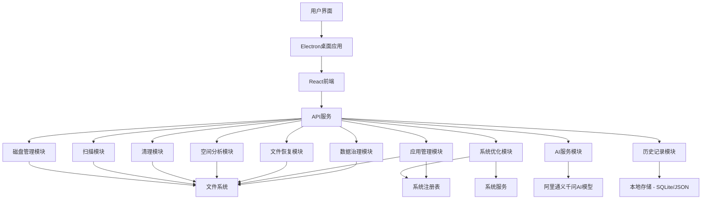

# CleanMaster Pro 技术设计文档

## 1. 技术架构设计

### 1.1 技术栈选择

| 分类 | 技术 | 版本 | 选型理由 |
|------|------|------|----------|
| 前端 | React | 18.x | 组件化开发，性能优异，生态丰富 |
| 前端 | TypeScript | 5.x | 类型安全，提高代码质量和可维护性 |
| 前端 | Tailwind CSS | 3.x | 实用优先，快速构建响应式界面 |
| 后端 | Node.js | 18.x | 跨平台，高性能，适合IO密集型操作 |
| 后端 | Express | 4.x | 轻量级，路由灵活，中间件丰富 |
| 桌面应用 | Electron | 20.x | 跨平台支持，基于Web技术，开发效率高 |
| 数据存储 | 本地文件系统 | - | 无需额外依赖，操作简单 |
| 数据存储 | JSON配置文件 | - | 结构清晰，易于读写 |
| 数据存储 | SQLite | 3.x | 轻量级数据库，适合存储结构化数据 |
| AI服务 | 阿里通义千问 API | - | 免费模型，强大的自然语言处理能力，支持智能分析 |
| 状态管理 | React Context API + useReducer | - | 轻量级状态管理，适合中小型应用 |
| 图表库 | Chart.js | 4.x | 响应式图表，支持多种可视化形式 |
| HTTP客户端 | Axios | 1.x | 功能强大，支持拦截器和取消请求 |

### 1.2 系统架构



### 1.3 核心技术点

1. **磁盘扫描**：使用高效的文件系统遍历算法，支持增量扫描，快速识别可清理文件
2. **空间分析**：使用树状结构分析磁盘空间使用情况，生成直观的空间分布报告
3. **文件恢复**：基于文件系统原理，扫描已删除文件的痕迹，支持文件恢复
4. **启动项管理**：通过系统API管理启动项，优化系统启动速度
5. **注册表清理**：安全地清理无效注册表项，避免系统问题
6. **应用管理**：深度扫描应用程序，识别损坏、未完全卸载和沉睡的应用
7. **AI集成**：使用阿里通义千问AI模型进行文件分析、分类和清理建议，提升用户体验
8. **跨平台**：使用Electron，支持Windows、macOS和Linux平台
9. **性能优化**：使用Web Workers处理密集型任务，避免UI阻塞
10. **安全保障**：建立文件删除白名单和黑名单机制，避免误删重要文件
11. **内存管理**：优化内存使用，确保工具运行流畅，不影响系统性能
12. **并发控制**：使用异步编程和并发控制，提高多任务处理能力

## 2. 模块设计

### 2.1 磁盘管理模块

#### 2.1.1 功能描述
- 获取磁盘信息：盘符、名称、总空间、已用空间、可用空间、使用百分比、文件系统类型、健康状态
- 空间使用分析：分析磁盘空间使用情况，生成空间分布报告
- 多磁盘统一管理：支持同时管理多个磁盘分区，提供统一的管理界面
- 实时监控：实时监控磁盘空间变化，及时发现异常情况

#### 2.1.2 实现方案
- 使用跨平台文件系统API获取磁盘信息，支持Windows、macOS和Linux
- 实现高效的磁盘空间计算和分析算法，减少系统资源占用
- 使用缓存机制提高频繁访问数据的响应速度
- 提供统一的磁盘管理接口，支持多平台适配

#### 2.1.3 关键类/函数
- `DiskManager`：磁盘管理核心类，负责磁盘信息获取和管理
- `GetDiskInfo()`：获取磁盘信息，支持多平台
- `AnalyzeDiskSpace()`：分析磁盘空间使用情况，生成详细报告
- `MonitorDiskChanges()`：实时监控磁盘空间变化
- `GetDiskHealthStatus()`：评估磁盘健康状态

### 2.2 扫描模块

#### 2.2.1 功能描述
- 快速扫描：识别临时文件、浏览器缓存等可清理项，速度快，资源占用低
- 深度扫描：详细分析磁盘内容，提供更全面的清理建议
- 智能分析：基于用户使用习惯，分析磁盘使用情况，生成个性化优化建议
- 增量扫描：只扫描上次扫描后变化的文件，提高扫描速度
- 后台扫描：在后台执行扫描，不影响用户正常操作

#### 2.2.2 实现方案
- 实现高效的文件系统遍历算法，使用异步编程提高性能
- 定义可清理文件类型和规则，支持自定义规则
- 实现智能分析算法，基于文件使用频率、时间和用户习惯
- 使用Web Workers处理密集型扫描任务，避免UI阻塞
- 实现扫描进度实时更新机制，提供良好的用户反馈

#### 2.2.3 关键类/函数
- `ScanManager`：扫描管理核心类，负责扫描任务的调度和管理
- `QuickScan()`：执行快速扫描，识别常见可清理项
- `DeepScan()`：执行深度扫描，详细分析磁盘内容
- `IncrementalScan()`：执行增量扫描，只扫描变化的文件
- `SmartAnalysis()`：执行智能分析，生成个性化优化建议
- `BackgroundScan()`：在后台执行扫描任务

### 2.3 清理模块

#### 2.3.1 功能描述
- 执行清理操作：根据扫描结果删除选中的文件，支持批量操作
- 设置自动清理：配置定时清理规则，包括执行时间、清理级别和目标磁盘
- 批量清理：支持同时清理多个磁盘或文件夹
- 清理预览：在执行清理前预览清理效果，避免误操作
- 安全清理：建立文件删除白名单和黑名单，确保重要文件不被删除

#### 2.3.2 实现方案
- 实现安全的文件删除操作，支持文件备份和恢复
- 设计自动清理任务调度系统，支持cron表达式配置
- 实现批量清理功能，支持并行处理提高效率
- 实现清理预览机制，显示预计节省空间和删除文件数
- 建立文件安全检查机制，避免误删重要文件

#### 2.3.3 关键类/函数
- `CleanManager`：清理管理核心类，负责清理任务的执行和管理
- `ExecuteClean()`：执行清理操作，支持安全检查
- `SetAutoClean()`：设置自动清理规则
- `BatchClean()`：执行批量清理操作
- `PreviewClean()`：预览清理效果
- `CheckFileSafety()`：检查文件安全性，避免误删

### 2.4 空间管理模块

#### 2.4.1 功能描述
- 空间使用情况分析：分析磁盘空间使用情况，生成详细的空间分布报告
- 大文件识别：识别占用空间较大的文件，支持按大小、类型等排序
- 空间可视化：使用饼图、树状图、热力图等多种形式直观展示磁盘空间使用情况
- 目录分析：分析目录结构，识别占用空间较大的目录

#### 2.4.2 实现方案
- 实现高效的空间分析算法，减少系统资源占用
- 设计大文件识别逻辑，支持自定义大小阈值
- 集成Chart.js实现多种空间可视化形式
- 实现目录树状结构分析，生成直观的空间分布报告
- 使用缓存机制提高频繁访问数据的响应速度

#### 2.4.3 关键类/函数
- `SpaceManager`：空间管理核心类，负责空间分析和可视化
- `AnalyzeSpaceUsage()`：分析空间使用情况，生成详细报告
- `IdentifyLargeFiles()`：识别大文件，支持自定义阈值
- `GenerateSpaceVisualization()`：生成空间可视化数据，支持多种图表类型
- `AnalyzeDirectories()`：分析目录结构，识别占用空间较大的目录

### 2.5 文件恢复模块

#### 2.5.1 功能描述
- 扫描可恢复文件：扫描已删除文件的痕迹，支持不同恢复模式
- 恢复已删除文件：恢复选中的已删除文件，支持指定恢复路径
- 文件预览：在恢复前预览文件内容，确保恢复正确的文件
- 恢复历史：记录文件恢复操作，支持恢复历史管理

#### 2.5.2 实现方案
- 实现文件系统痕迹扫描算法，支持不同文件系统
- 设计文件恢复逻辑，确保恢复的文件完整性
- 实现文件预览机制，支持常见文件类型的预览
- 使用异步编程提高扫描和恢复性能
- 实现恢复历史记录和管理功能

#### 2.5.3 关键类/函数
- `RecoveryManager`：文件恢复核心类，负责文件恢复操作
- `ScanRecoverableFiles()`：扫描可恢复文件，支持不同恢复模式
- `RecoverFile()`：恢复已删除文件，支持指定恢复路径
- `PreviewFile()`：预览可恢复文件内容
- `GetRecoveryHistory()`：获取恢复历史记录

### 2.6 系统优化模块

#### 2.6.1 功能描述
- 启动项管理：管理系统启动项，启用或禁用不必要的启动程序
- 注册表清理：清理无效的注册表项，优化系统性能
- 服务管理：管理系统服务，禁用不必要的服务
- 系统信息：显示系统详细信息，提供优化建议

#### 2.6.2 实现方案
- 实现跨平台的启动项管理逻辑，支持不同操作系统
- 设计安全的注册表清理算法，避免误删有效注册表项
- 实现系统服务管理逻辑，支持服务状态监控和管理
- 提供系统信息收集和分析功能，生成优化建议
- 实现操作前备份机制，确保系统安全

#### 2.6.3 关键类/函数
- `OptimizationManager`：系统优化核心类，负责系统优化操作
- `ManageStartupItems()`：管理启动项，支持启用/禁用操作
- `CleanRegistry()`：清理无效注册表项，支持安全检查
- `ManageServices()`：管理系统服务，支持状态监控和管理
- `GetSystemInfo()`：获取系统详细信息，生成优化建议

### 2.7 清理历史模块

#### 2.7.1 功能描述
- 查看清理历史记录：记录清理操作，包括清理时间、清理类型、节省空间等信息
- 清理效果分析：分析清理效果，生成清理报告和趋势分析
- 历史数据管理：管理历史数据，支持数据导出和清理

#### 2.7.2 实现方案
- 使用SQLite存储清理历史记录，提高数据管理效率
- 设计清理效果分析算法，生成详细的清理报告
- 实现历史数据管理功能，支持数据导出和清理
- 使用缓存机制提高历史数据查询性能

#### 2.7.3 关键类/函数
- `HistoryManager`：清理历史管理核心类，负责历史记录的管理和分析
- `GetCleanHistory()`：获取清理历史记录，支持筛选和排序
- `AnalyzeCleanEffect()`：分析清理效果，生成清理报告
- `ExportHistory()`：导出历史数据，支持多种格式
- `CleanHistory()`：清理历史数据，支持保留期限设置

### 2.8 文件夹归类模块

#### 2.8.1 功能描述
- 智能文件夹归类：自动识别和归类文件夹，基于文件类型和使用习惯
- 文件整理建议：提供个性化的文件整理建议，优化文件结构
- 避免误删：建立文件安全检查机制，防止用户错误删除应用程序或插件
- 批量整理：支持批量文件整理操作，提高效率

#### 2.8.2 实现方案
- 实现基于AI的文件夹智能归类算法，提高归类准确性
- 设计文件整理建议逻辑，基于用户使用习惯
- 实现文件安全检查机制，建立重要文件白名单
- 实现批量整理功能，支持并行处理提高效率
- 提供整理预览机制，显示整理效果

#### 2.8.3 关键类/函数
- `FolderManager`：文件夹管理核心类，负责文件夹归类和整理
- `CategorizeFolders()`：智能归类文件夹，基于文件类型和使用习惯
- `GenerateFileOrganizationSuggestions()`：生成文件整理建议
- `CheckFileSafety()`：检查文件安全性，避免误删
- `BatchOrganizeFiles()`：执行批量文件整理操作

### 2.9 AI服务模块

#### 2.9.1 功能描述
- 文件分析：分析文件内容和属性，提供详细的文件信息
- 文件分类：自动分类文件，基于文件内容和类型
- 文件名生成：生成优化的文件名，提高文件识别度
- 清理建议：提供智能清理建议，基于用户使用习惯和磁盘状态
- 用户习惯学习：学习用户使用习惯，优化文件组织方式
- AI模型管理：管理AI模型配置和使用，支持模型切换

#### 2.9.2 实现方案
- 集成阿里通义千问AI模型API，提供智能分析能力
- 设计AI分析和建议逻辑，基于用户数据和磁盘状态
- 实现用户习惯学习机制，建立用户行为模型
- 实现AI模型配置管理，支持模型参数调整
- 实现API调用错误处理和重试机制，提高可靠性
- 实现本地缓存机制，减少API调用频率

#### 2.9.3 关键类/函数
- `AIService`：AI服务核心类，负责AI模型的调用和管理
- `AnalyzeFile()`：分析文件内容和属性
- `CategorizeFiles()`：自动分类文件，基于文件内容和类型
- `GenerateFileName()`：生成优化的文件名
- `GetCleaningSuggestions()`：获取智能清理建议
- `LearnUserHabits()`：学习用户使用习惯，优化文件组织方式
- `ManageAIModel()`：管理AI模型配置和使用

### 2.10 数据治理模块

#### 2.10.1 功能描述
- 文件元数据管理：管理文件元数据，提高文件搜索和管理效率
- 重复文件检测：检测系统中的重复文件，提供智能去重建议
- 文件版本管理：管理文件的多个版本，支持版本回溯
- 数据结构优化：优化文件结构，符合AI管理逻辑，提高文件组织效率
- 数据备份：提供文件备份功能，确保数据安全

#### 2.10.2 实现方案
- 实现文件元数据管理逻辑，支持元数据索引和搜索
- 设计高效的重复文件检测算法，基于文件内容和哈希值
- 实现文件版本管理机制，支持版本创建和回溯
- 设计数据结构优化策略，基于AI分析和用户习惯
- 实现数据备份功能，支持自动和手动备份

#### 2.10.3 关键类/函数
- `GovernanceManager`：数据治理核心类，负责数据管理和优化
- `ManageFileMetadata()`：管理文件元数据，提高搜索效率
- `DetectDuplicateFiles()`：检测重复文件，提供去重建议
- `ManageFileVersions()`：管理文件版本，支持版本回溯
- `OptimizeDataStructure()`：优化数据结构，提高文件组织效率
- `BackupData()`：执行数据备份，确保数据安全

### 2.11 应用程序管理模块

#### 2.11.1 功能描述
- 应用扫描：扫描系统中的应用程序，识别损坏、未完全卸载和沉睡的应用
- 应用卸载：卸载选中的应用程序，支持批量操作
- 残留文件清理：清理应用程序的残留文件和注册表项
- 应用使用分析：分析应用使用频率和资源占用，提供优化建议
- 应用备份：在卸载前备份应用数据，确保数据安全

#### 2.11.2 实现方案
- 实现跨平台的应用程序扫描逻辑，支持不同操作系统
- 设计应用程序状态分析算法，识别问题应用
- 实现应用卸载和残留清理功能，支持批量操作
- 实现应用使用分析功能，基于使用频率和资源占用
- 实现应用备份功能，确保卸载前数据安全

#### 2.11.3 关键类/函数
- `AppManager`：应用管理核心类，负责应用程序的管理和分析
- `ScanApplications()`：扫描应用程序，识别问题应用
- `UninstallApp()`：卸载应用程序，支持批量操作
- `CleanResidualFiles()`：清理应用残留文件和注册表项
- `AnalyzeAppUsage()`：分析应用使用情况，提供优化建议
- `BackupAppData()`：在卸载前备份应用数据

## 3. 数据结构设计

### 3.1 核心数据结构

#### 3.1.1 磁盘信息 (Disk)
```typescript
interface Disk {
  letter: string;           // 盘符，如 "C:"
  name: string;             // 磁盘名称，如 "系统盘"
  totalSpace: number;       // 总空间（字节）
  usedSpace: number;        // 已用空间（字节）
  freeSpace: number;        // 可用空间（字节）
  percentage: number;       // 使用百分比（0-100）
  fileSystem: string;       // 文件系统类型，如 "NTFS"
  healthStatus: 'healthy' | 'warning' | 'critical';  // 健康状态
  mountPoint: string;       // 挂载点
  isSystem: boolean;        // 是否系统盘
}
```

#### 3.1.2 用户设置 (Settings)
```typescript
interface Settings {
  language: 'zh-CN' | 'en-US';  // 语言
  theme: 'light' | 'dark' | 'system';  // 主题
  autoStart: boolean;           // 自动启动
  defaultCleanLevel: 'quick' | 'standard' | 'deep';  // 默认清理级别
  historyRetention: number;     // 历史保留天数
  autoCleanEnabled: boolean;    // 自动清理启用状态
  autoCleanSchedule: string;    // 自动清理计划（cron表达式）
  scanTimeout: number;          // 扫描超时时间（分钟）
  maxHistoryItems: number;      // 最大历史记录数
  aiEnabled: boolean;           // AI功能启用状态
  aiModel: string;              // AI模型选择
  safetyLevel: 'low' | 'medium' | 'high';  // 安全级别
  excludedPaths: string[];      // 排除路径列表
  customCleanRules: CleanRule[];  // 自定义清理规则
}

interface CleanRule {
  id: string;                 // 规则ID
  name: string;               // 规则名称
  pattern: string;            // 文件模式
  description: string;        // 规则描述
  enabled: boolean;           // 是否启用
}
```

#### 3.1.3 扫描结果 (ScanResult)
```typescript
interface ScanResult {
  scanId: string;            // 扫描ID
  timestamp: string;         // 扫描时间（ISO 8601）
  disk: string;              // 扫描的磁盘
  totalSpace: number;        // 总空间（字节）
  usedSpace: number;         // 已用空间（字节）
  cleanableSpace: number;    // 可清理空间（字节）
  fileTypes: FileType[];     // 文件类型分布
  files?: FileInfo[];        // 详细文件列表（深度扫描）
  scanType: 'quick' | 'deep' | 'incremental';  // 扫描类型
  duration: number;          // 扫描持续时间（秒）
  recommendations: string[];  // 扫描建议
}

interface FileType {
  type: string;              // 类型名称
  size: number;              // 大小（字节）
  percentage: number;        // 占比（0-100）
  count: number;             // 文件数量
}

interface FileInfo {
  path: string;              // 文件路径
  size: number;              // 文件大小（字节）
  lastModified: string;      // 最后修改时间（ISO 8601）
  lastAccessed: string;      // 最后访问时间（ISO 8601）
  type: string;              // 文件类型
  extension: string;         // 文件扩展名
  isSystem: boolean;         // 是否系统文件
  isHidden: boolean;         // 是否隐藏文件
  isReadonly: boolean;       // 是否只读文件
  safety: 'safe' | 'warning' | 'danger';  // 安全级别
}
```

#### 3.1.4 应用程序信息 (Application)
```typescript
interface Application {
  id: string;                // 应用ID
  name: string;              // 应用名称
  displayName: string;       // 显示名称
  version: string;           // 版本号
  publisher: string;         // 发布者
  installDate: string;       // 安装日期（ISO 8601）
  installLocation: string;   // 安装路径
  size: number;              // 占用空间（字节）
  lastUsedTime?: string;     // 最后使用时间
  usageCount: number;        // 使用次数
  status: 'healthy' | 'broken' | 'incomplete' | 'dormant' | 'unknown';  // 健康状态
  statusReason: string;      // 状态原因描述
  recommendation: 'keep' | 'remove' | 'review';  // 清理建议
  recommendationReason: string;  // 建议原因
  confidence: number;        // 建议置信度（0-100）
  residualFiles?: ResidualFile[];  // 残留文件
  registryEntries?: RegistryEntry[];  // 注册表项
  startupItems?: StartupItem[];  // 启动项
  services?: Service[];      // 相关服务
  dependencies: string[];    // 依赖项
}

interface ResidualFile {
  path: string;              // 文件路径
  size: number;              // 文件大小（字节）
  type: 'executable' | 'config' | 'data' | 'log' | 'temp';  // 文件类型
  lastModified: string;      // 最后修改时间
  isSafeToDelete: boolean;   // 是否安全删除
}

interface RegistryEntry {
  key: string;               // 注册表键
  value: string;             // 注册表值
  type: string;              // 值类型
  isSafeToDelete: boolean;   // 是否安全删除
}

interface StartupItem {
  id: string;                // 启动项ID
  name: string;              // 启动项名称
  path: string;              // 启动项路径
  enabled: boolean;          // 是否启用
  impact: 'low' | 'medium' | 'high';  // 启动影响
}

interface Service {
  id: string;                // 服务ID
  name: string;              // 服务名称
  status: 'running' | 'stopped' | 'paused';  // 服务状态
  startupType: 'auto' | 'manual' | 'disabled';  // 启动类型
  impact: 'low' | 'medium' | 'high';  // 系统影响
}
```

#### 3.1.5 清理历史 (CleanHistory)
```typescript
interface CleanHistory {
  id: string;                // 记录ID
  timestamp: string;         // 清理时间（ISO 8601）
  disk: string;              // 清理的磁盘
  cleanType: 'quick' | 'standard' | 'deep' | 'auto' | 'batch';  // 清理类型
  spaceSaved: number;        // 节省空间（字节）
  filesDeleted: number;      // 删除文件数
  duration: number;          // 清理持续时间（秒）
  scanId?: string;           // 关联的扫描ID
  details: CleanDetail[];    // 清理详情
}

interface CleanDetail {
  type: string;              // 清理类型
  count: number;             // 文件数量
  size: number;              // 清理大小（字节）
  paths: string[];           // 清理路径
}
```

#### 3.1.6 空间使用 (SpaceUsage)
```typescript
interface SpaceUsage {
  disk: string;              // 磁盘
  totalSpace: number;        // 总空间（字节）
  usedSpace: number;         // 已用空间（字节）
  freeSpace: number;         // 可用空间（字节）
  fileTypes: FileType[];     // 文件类型分布
  largeFiles: LargeFile[];   // 大文件列表
  topDirectories: DirectoryInfo[];  // 占用空间最多的目录
  growthRate: number;        // 空间增长速率（字节/天）
  lastAnalyzed: string;      // 最后分析时间
}

interface LargeFile {
  path: string;              // 文件路径
  size: number;              // 文件大小（字节）
  lastModified: string;      // 最后修改时间
  type: string;              // 文件类型
}

interface DirectoryInfo {
  path: string;              // 目录路径
  size: number;              // 目录大小（字节）
  fileCount: number;         // 文件数量
  subdirectories: number;    // 子目录数量
}
```

#### 3.1.7 恢复文件 (RecoverableFile)
```typescript
interface RecoverableFile {
  id: string;                // 文件ID
  name: string;              // 文件名
  path: string;              // 原文件路径
  size: number;              // 文件大小（字节）
  deletedDate: string;       // 删除日期（ISO 8601）
  lastModified: string;      // 最后修改时间
  type: string;              // 文件类型
  recoverable: boolean;      // 是否可恢复
  recoveryChance: 'low' | 'medium' | 'high';  // 恢复成功率
  previewAvailable: boolean;  // 是否可预览
}
```

#### 3.1.8 AI分析结果 (AIAnalysisResult)
```typescript
interface AIAnalysisResult {
  id: string;                // 分析ID
  timestamp: string;         // 分析时间
  disk: string;              // 分析的磁盘
  suggestions: AISuggestion[];  // AI建议
  userHabits: UserHabit[];   // 用户习惯分析
  fileCategories: FileCategory[];  // 文件分类
  confidence: number;        // 分析置信度（0-100）
}

interface AISuggestion {
  id: string;                // 建议ID
  type: 'clean' | 'organize' | 'optimize';  // 建议类型
  description: string;       // 建议描述
  priority: 'low' | 'medium' | 'high';  // 优先级
  estimatedBenefit: number;  // 预计收益（字节）
  actionRequired: boolean;   // 是否需要用户操作
}

interface UserHabit {
  type: string;              // 习惯类型
  frequency: number;         // 频率
  lastObserved: string;      // 最后观察时间
  impact: 'low' | 'medium' | 'high';  // 影响程度
}

interface FileCategory {
  name: string;              // 分类名称
  count: number;             // 文件数量
  size: number;              // 总大小（字节）
  growthRate: number;        // 增长速率（字节/天）
}
```

## 4. API接口设计

### 4.1 基础信息

- **基础路径**: `/api`
- **内容类型**: `application/json`
- **认证机制**: API密钥认证（可选，用于保护敏感操作）
- **请求限制**: 速率限制，防止滥用（每IP每分钟60次请求）
- **CORS配置**: 支持跨域请求
- **通用响应格式**:
  ```json
  {
    "success": true,
    "data": { /* 具体数据 */ },
    "message": "操作成功",
    "timestamp": "2026-04-05T10:00:00.000Z",
    "requestId": "unique-request-id"
  }
  ```
- **错误响应格式**:
  ```json
  {
    "success": false,
    "error": {
      "code": "ERROR_CODE",
      "message": "错误描述",
      "details": "详细错误信息（可选）"
    },
    "timestamp": "2026-04-05T10:00:00.000Z",
    "requestId": "unique-request-id"
  }
  ```

### 4.2 接口列表

#### 4.2.1 磁盘管理

| 接口 | 方法 | 路径 | 描述 | 请求参数 | 响应数据 | 权限 |
|------|------|------|------|----------|----------|------|
| 获取磁盘信息 | GET | /api/disks | 获取所有磁盘信息 | 无 | `Disk[]` | 无需 |
| 获取磁盘详情 | GET | /api/disks/:letter | 获取指定磁盘详细信息 | letter: string（盘符） | `Disk` | 无需 |
| 分析磁盘空间 | POST | /api/disks/:letter/analyze | 分析指定磁盘空间 | letter: string（盘符）, depth: number（可选，分析深度） | `SpaceUsage` | 无需 |
| 监控磁盘变化 | GET | /api/disks/monitor | 实时监控磁盘空间变化 | interval: number（可选，监控间隔，单位秒） | `{ disks: Disk[] }` | 无需 |
| 获取磁盘健康状态 | GET | /api/disks/:letter/health | 获取磁盘健康状态 | letter: string（盘符） | `{ healthStatus: string, temperature: number, smartData: object }` | 无需 |

#### 4.2.2 扫描功能

| 接口 | 方法 | 路径 | 描述 | 请求参数 | 响应数据 | 权限 |
|------|------|------|------|----------|----------|------|
| 快速扫描 | POST | /api/scan/quick | 执行快速扫描 | disk: string（可选，默认C:）, excludePaths: string[]（可选，排除路径） | `{ scanId: string, status: string }` | 无需 |
| 深度扫描 | POST | /api/scan/deep | 执行深度扫描 | disk: string（可选，默认C:）, excludePaths: string[]（可选，排除路径）, fileTypes: string[]（可选，文件类型） | `{ scanId: string, status: string }` | 无需 |
| 增量扫描 | POST | /api/scan/incremental | 执行增量扫描 | disk: string（可选，默认C:）, lastScanTime: string（上次扫描时间） | `{ scanId: string, status: string }` | 无需 |
| 智能分析 | POST | /api/scan/analysis | 执行智能分析 | disk: string（可选，默认C:）, userId: string（可选，用户ID） | `{ scanId: string, status: string }` | 无需 |
| 后台扫描 | POST | /api/scan/background | 在后台执行扫描 | disk: string（可选，默认C:）, scanType: string（扫描类型） | `{ scanId: string, status: string }` | 无需 |
| 获取扫描结果 | GET | /api/scan/:scanId | 获取扫描结果 | scanId: string（扫描ID） | `ScanResult` | 无需 |
| 取消扫描 | POST | /api/scan/:scanId/cancel | 取消正在进行的扫描 | scanId: string（扫描ID） | `{ success: boolean }` | 无需 |
| 获取扫描进度 | GET | /api/scan/:scanId/progress | 获取扫描进度 | scanId: string（扫描ID） | `{ progress: number, status: string, currentFile: string }` | 无需 |

#### 4.2.3 清理执行

| 接口 | 方法 | 路径 | 描述 | 请求参数 | 响应数据 | 权限 |
|------|------|------|------|----------|----------|------|
| 执行清理 | POST | /api/clean/execute | 执行清理操作 | scanId: string（扫描ID）, files: string[]（文件路径）, safetyLevel: string（可选，安全级别） | `{ cleanId: string, status: string }` | 需要 |
| 预览清理 | POST | /api/clean/preview | 预览清理效果 | scanId: string（扫描ID）, files: string[]（文件路径） | `{ estimatedSpaceSaved: number, filesToDelete: number, safetyCheck: object }` | 无需 |
| 设置自动清理 | PUT | /api/clean/auto | 设置自动清理 | enabled: boolean, schedule: string（cron表达式）, cleanLevel: string, disks: string[]（目标磁盘） | `{ success: boolean, settings: object }` | 需要 |
| 执行批量清理 | POST | /api/clean/batch | 执行批量清理 | disks: string[]（盘符列表）, type: string（清理类型）, excludePaths: string[]（可选，排除路径） | `{ cleanId: string, status: string }` | 需要 |
| 获取清理结果 | GET | /api/clean/:cleanId | 获取清理结果 | cleanId: string（清理ID） | `{ cleanId: string, spaceSaved: number, filesDeleted: number, duration: number, details: object[] }` | 无需 |
| 取消清理 | POST | /api/clean/:cleanId/cancel | 取消正在进行的清理 | cleanId: string（清理ID） | `{ success: boolean }` | 需要 |
| 获取清理进度 | GET | /api/clean/:cleanId/progress | 获取清理进度 | cleanId: string（清理ID） | `{ progress: number, status: string, spaceSaved: number }` | 无需 |

#### 4.2.4 空间管理

| 接口 | 方法 | 路径 | 描述 | 请求参数 | 响应数据 | 权限 |
|------|------|------|------|----------|----------|------|
| 获取空间使用 | GET | /api/space/:disk/usage | 获取空间使用情况 | disk: string（可选，默认C:） | `SpaceUsage` | 无需 |
| 识别大文件 | GET | /api/space/:disk/large-files | 识别大文件 | disk: string（可选，默认C:）, minSize: number（最小文件大小）, sortBy: string（可选，排序字段） | `LargeFile[]` | 无需 |
| 获取空间可视化数据 | GET | /api/space/:disk/visualization | 获取空间可视化数据 | disk: string（可选，默认C:）, type: string（可视化类型） | `{ fileTypes: object[], directories: object[], heatmap: object[] }` | 无需 |
| 分析目录结构 | GET | /api/space/:disk/directories | 分析目录结构 | disk: string（可选，默认C:）, maxDepth: number（可选，最大深度） | `{ directories: object[] }` | 无需 |
| 获取空间趋势 | GET | /api/space/:disk/trend | 获取空间使用趋势 | disk: string（可选，默认C:）, period: string（时间范围） | `{ trend: object[] }` | 无需 |

#### 4.2.5 文件恢复

| 接口 | 方法 | 路径 | 描述 | 请求参数 | 响应数据 | 权限 |
|------|------|------|------|----------|----------|------|
| 扫描可恢复文件 | POST | /api/recovery/scan | 扫描可恢复文件 | disk: string（可选，默认C:）, type: string（扫描类型）, depth: number（可选，扫描深度） | `{ recoveryId: string, status: string }` | 无需 |
| 获取可恢复文件 | GET | /api/recovery/:recoveryId | 获取可恢复文件列表 | recoveryId: string（恢复ID）, filter: object（可选，过滤条件） | `RecoverableFile[]` | 无需 |
| 恢复文件 | POST | /api/recovery/recover | 恢复选中的文件 | recoveryId: string（恢复ID）, files: string[]（待恢复文件列表）, targetPath: string（恢复路径） | `{ success: boolean, recoveredCount: number, recoveredFiles: string[] }` | 需要 |
| 预览文件 | POST | /api/recovery/preview | 预览可恢复文件内容 | fileId: string（文件ID）, previewType: string（预览类型） | `{ content: string, previewAvailable: boolean, previewType: string }` | 无需 |
| 获取恢复历史 | GET | /api/recovery/history | 获取恢复历史记录 | page: number（可选，页码）, limit: number（可选，每页数量） | `{ total: number, items: object[] }` | 无需 |
| 取消恢复 | POST | /api/recovery/:recoveryId/cancel | 取消正在进行的恢复 | recoveryId: string（恢复ID） | `{ success: boolean }` | 需要 |

#### 4.2.6 系统优化

| 接口 | 方法 | 路径 | 描述 | 请求参数 | 响应数据 | 权限 |
|------|------|------|------|----------|----------|------|
| 获取启动项 | GET | /api/optimization/startup | 获取启动项列表 | 无 | `StartupItem[]` | 无需 |
| 管理启动项 | PUT | /api/optimization/startup | 管理启动项 | items: object[]（启动项列表） | `{ success: boolean, updatedCount: number }` | 需要 |
| 清理注册表 | POST | /api/optimization/registry | 清理注册表 | backup: boolean（可选，是否备份） | `{ registryId: string, status: string }` | 需要 |
| 获取系统信息 | GET | /api/optimization/system-info | 获取系统信息 | 无 | `{ os: string, cpu: string, memory: number, disk: object[] }` | 无需 |
| 管理系统服务 | PUT | /api/optimization/services | 管理系统服务 | services: object[]（服务列表） | `{ success: boolean, updatedCount: number }` | 需要 |
| 获取服务列表 | GET | /api/optimization/services | 获取系统服务列表 | 无 | `Service[]` | 无需 |
| 优化系统性能 | POST | /api/optimization/performance | 优化系统性能 | optimizations: object[]（优化选项） | `{ optimizationId: string, status: string }` | 需要 |

#### 4.2.7 清理历史

| 接口 | 方法 | 路径 | 描述 | 请求参数 | 响应数据 | 权限 |
|------|------|------|------|----------|----------|------|
| 获取清理历史 | GET | /api/history | 获取清理历史记录 | page: number（可选，页码）, limit: number（可选，每页数量）, filter: object（可选，过滤条件） | `{ total: number, items: CleanHistory[] }` | 无需 |
| 分析清理效果 | GET | /api/history/analysis | 分析清理效果 | period: string（时间范围） | `{ totalSpaceSaved: number, averageCleanTime: number, mostCleanedType: string }` | 无需 |
| 导出历史数据 | GET | /api/history/export | 导出历史数据 | format: string（导出格式）, period: string（可选，时间范围） | `{ downloadUrl: string, fileName: string }` | 无需 |
| 清理历史记录 | POST | /api/history/clean | 清理历史记录 | days: number（保留天数）, keepImportant: boolean（可选，是否保留重要记录） | `{ success: boolean, deletedCount: number, remainingCount: number }` | 需要 |
| 获取历史统计 | GET | /api/history/stats | 获取历史统计数据 | period: string（时间范围） | `{ totalCleanings: number, totalSpaceSaved: number, averageSpaceSaved: number, mostActiveDay: string }` | 无需 |

#### 4.2.8 文件夹归类

| 接口 | 方法 | 路径 | 描述 | 请求参数 | 响应数据 | 权限 |
|------|------|------|------|----------|----------|------|
| 智能归类 | POST | /api/folder/categorize | 智能归类文件夹 | path: string（可选，默认C:\）, useAI: boolean（可选，是否使用AI） | `{ categorizationId: string, status: string }` | 无需 |
| 获取归类结果 | GET | /api/folder/categorize/:categorizationId | 获取归类结果 | categorizationId: string（归类ID） | `FolderCategorization` | 无需 |
| 获取整理建议 | GET | /api/folder/suggestions | 获取文件整理建议 | path: string（可选，默认C:\） | `{ suggestions: string[] }` | 无需 |
| 执行文件整理 | POST | /api/folder/organize | 执行文件整理 | path: string（可选，默认C:\）, strategy: string（整理策略） | `{ organizeId: string, status: string }` | 需要 |

#### 4.2.9 AI服务

| 接口 | 方法 | 路径 | 描述 | 请求参数 | 响应数据 | 权限 |
|------|------|------|------|----------|----------|------|
| 分析文件 | POST | /api/ai/analyze-file | 分析单个文件 | filePath: string（文件路径）, analysisType: string（分析类型） | `{ analysis: string, confidence: number, suggestions: string[] }` | 无需 |
| 分类文件 | POST | /api/ai/categorize-files | 批量分类文件 | files: string[]（文件路径列表）, categories: object[]（可选，分类规则） | `{ categories: object[] }` | 无需 |
| 生成文件名 | POST | /api/ai/generate-filename | 生成优化的文件名 | filePath: string（原文件路径）, context: string（可选，上下文信息） | `{ suggestedName: string, confidence: number }` | 无需 |
| 获取清理建议 | POST | /api/ai/cleaning-suggestions | 获取清理建议 | disk: string（可选，默认C:\）, userId: string（可选，用户ID）, scanId: string（可选，扫描ID） | `{ suggestions: object[] }` | 无需 |
| 学习用户习惯 | POST | /api/ai/learn | 学习用户使用习惯 | userActions: object[]（用户操作记录）, userId: string（可选，用户ID） | `{ success: boolean, learnedPatterns: number }` | 无需 |
| 管理AI模型 | PUT | /api/ai/model | 管理AI模型配置 | model: string（模型名称）, parameters: object（模型参数） | `{ success: boolean }` | 需要 |
| 获取AI状态 | GET | /api/ai/status | 获取AI服务状态 | 无 | `{ status: string, model: string, usage: object }` | 无需 |

#### 4.2.10 数据治理

| 接口 | 方法 | 路径 | 描述 | 请求参数 | 响应数据 | 权限 |
|------|------|------|------|----------|----------|------|
| 分析文件分类 | POST | /api/governance/categories | 分析文件分类 | disk: string（可选，默认C:）, useAI: boolean（可选，是否使用AI） | `{ analysisId: string, status: string }` | 无需 |
| 获取文件分类 | GET | /api/governance/categories/:analysisId | 获取文件分类结果 | analysisId: string（分析ID） | `{ categories: object[] }` | 无需 |
| 优化数据结构 | POST | /api/governance/optimize | 优化数据结构 | path: string（可选，默认C:\）, strategy: string（优化策略）, preview: boolean（可选，是否预览） | `{ optimizeId: string, status: string }` | 需要 |
| 检测重复文件 | POST | /api/governance/duplicates | 检测重复文件 | disk: string（可选，默认C:）, minSize: number（可选，最小文件大小）, method: string（可选，检测方法） | `{ scanId: string, status: string }` | 无需 |
| 获取重复文件 | GET | /api/governance/duplicates/:scanId | 获取重复文件列表 | scanId: string（扫描ID） | `object[]` | 无需 |
| 管理文件元数据 | PUT | /api/governance/metadata | 管理文件元数据 | files: object[]（文件列表）, metadata: object（元数据） | `{ success: boolean, updatedCount: number }` | 需要 |
| 管理文件版本 | GET | /api/governance/versions | 获取文件版本信息 | filePath: string（文件路径） | `{ versions: object[] }` | 无需 |
| 备份数据 | POST | /api/governance/backup | 执行数据备份 | disk: string（可选，默认C:）, backupPath: string（备份路径）, files: string[]（可选，文件列表） | `{ backupId: string, status: string }` | 需要 |

#### 4.2.11 应用程序管理

| 接口 | 方法 | 路径 | 描述 | 请求参数 | 响应数据 | 权限 |
|------|------|------|------|----------|----------|------|
| 扫描应用程序 | POST | /api/apps/scan | 扫描应用程序 | 无 | `{ scanId: string, status: string }` | 无需 |
| 获取应用列表 | GET | /api/apps | 获取应用程序列表 | filter: object（可选，过滤条件）, sortBy: string（可选，排序字段） | `Application[]` | 无需 |
| 获取应用详情 | GET | /api/apps/:id | 获取应用详情 | id: string（应用ID） | `Application` | 无需 |
| 卸载应用 | POST | /api/apps/:id/uninstall | 卸载应用 | id: string（应用ID）, removeResidual: boolean, createBackup: boolean | `{ uninstallId: string, status: string }` | 需要 |
| 清理残留 | POST | /api/apps/clean-residual | 清理残留文件 | appId: string（应用ID）, files: string[]（文件路径）, registryKeys: string[]（注册表键） | `{ cleanId: string, status: string }` | 需要 |
| 分析应用使用情况 | GET | /api/apps/usage | 分析应用使用情况 | period: string（可选，时间范围） | `object[]` | 无需 |
| 备份应用数据 | POST | /api/apps/:id/backup | 备份应用数据 | id: string（应用ID）, backupPath: string（备份路径） | `{ backupId: string, status: string }` | 需要 |
| 获取应用建议 | GET | /api/apps/recommendations | 获取应用清理建议 | 无 | `{ totalApps: number, brokenCount: number, incompleteCount: number, dormantCount: number, totalRecommendations: number, totalSpaceSaved: number, highPriority: AppRecommendation[], mediumPriority: AppRecommendation[], lowPriority: AppRecommendation[] }` | 无需 |

#### 4.2.12 设置管理

| 接口 | 方法 | 路径 | 描述 | 请求参数 | 响应数据 | 权限 |
|------|------|------|------|----------|----------|------|
| 获取设置 | GET | /api/settings | 获取用户设置 | 无 | `Settings` | 无需 |
| 更新设置 | PUT | /api/settings | 更新用户设置 | settings: object（设置对象） | `{ success: boolean, updatedSettings: string[] }` | 需要 |
| 重置设置 | POST | /api/settings/reset | 重置设置为默认值 | 无 | `{ success: boolean, resetSettings: string[] }` | 需要 |
| 获取默认设置 | GET | /api/settings/default | 获取默认设置 | 无 | `Settings` | 无需 |
| 导入设置 | POST | /api/settings/import | 导入设置 | settings: object（设置对象） | `{ success: boolean, importedSettings: string[] }` | 需要 |
| 导出设置 | GET | /api/settings/export | 导出设置 | 无 | `{ downloadUrl: string, fileName: string }` | 无需 |

#### 4.2.13 系统管理

| 接口 | 方法 | 路径 | 描述 | 请求参数 | 响应数据 | 权限 |
|------|------|------|------|----------|----------|------|
| 获取系统状态 | GET | /api/system/status | 获取系统状态 | 无 | `{ cpu: number, memory: number, disk: number, network: number }` | 无需 |
| 获取API状态 | GET | /api/system/health | 获取API服务健康状态 | 无 | `{ status: string, uptime: number, version: string }` | 无需 |
| 获取版本信息 | GET | /api/system/version | 获取应用版本信息 | 无 | `{ version: string, build: string, releaseDate: string }` | 无需 |
| 检查更新 | GET | /api/system/check-update | 检查应用更新 | 无 | `{ hasUpdate: boolean, version: string, downloadUrl: string, releaseNotes: string }` | 无需 |

## 5. 实现方案

### 5.1 前端实现

#### 5.1.1 技术选型
- **框架**: React 18.x
- **语言**: TypeScript 5.x
- **样式**: Tailwind CSS 3.x
- **状态管理**: React Context API + useReducer
- **路由**: React Router 6.x
- **图表**: Chart.js
- **HTTP客户端**: Axios
- **动画**: Framer Motion
- **表单处理**: React Hook Form
- **验证**: Zod
- **本地存储**: localStorage / IndexedDB
- **性能优化**: React.memo, useMemo, useCallback

#### 5.1.2 目录结构
```
src/
  ├── components/         # 通用组件
  │   ├── common/         # 通用UI组件
  │   │   ├── Button.tsx  # 按钮组件
  │   │   ├── Card.tsx    # 卡片组件
  │   │   └── ...
  │   ├── disk/           # 磁盘相关组件
  │   │   ├── DiskCard.tsx    # 磁盘信息卡片
  │   │   ├── DiskHealth.tsx  # 磁盘健康状态
  │   │   └── ...
  │   ├── scan/           # 扫描相关组件
  │   │   ├── ScanProgress.tsx # 扫描进度条
  │   │   ├── ScanOptions.tsx  # 扫描选项
  │   │   └── ...
  │   ├── clean/          # 清理相关组件
  │   │   ├── CleanConfirm.tsx # 清理确认弹窗
  │   │   ├── CleanProgress.tsx # 清理进度条
  │   │   └── ...
  │   ├── space/          # 空间管理组件
  │   │   ├── SpaceVisualization.tsx # 空间可视化
  │   │   ├── LargeFiles.tsx         # 大文件列表
  │   │   └── ...
  │   └── layout/         # 布局组件
  │       ├── Navbar.tsx  # 导航栏
  │       ├── Sidebar.tsx # 侧边栏
  │       └── ...
  ├── pages/              # 页面组件
  │   ├── HomePage.tsx    # 主页面
  │   ├── ScanPage.tsx    # 扫描页面
  │   ├── CleanPage.tsx   # 清理页面
  │   ├── SpacePage.tsx   # 空间管理页面
  │   ├── RecoveryPage.tsx # 文件恢复页面
  │   ├── OptimizationPage.tsx # 系统优化页面
  │   ├── AppPage.tsx     # 应用管理页面
  │   ├── GovernancePage.tsx # 数据治理页面
  │   ├── HistoryPage.tsx # 清理历史页面
  │   ├── SettingsPage.tsx # 设置页面
  │   └── ...
  ├── services/           # 服务层
  │   ├── api.ts          # API调用封装
  │   ├── diskService.ts  # 磁盘服务
  │   ├── scanService.ts  # 扫描服务
  │   ├── cleanService.ts # 清理服务
  │   ├── aiService.ts    # AI服务
  │   └── ...
  ├── contexts/           # 上下文
  │   ├── AppContext.tsx  # 应用上下文
  │   ├── ThemeContext.tsx # 主题上下文
  │   └── ...
  ├── hooks/              # 自定义钩子
  │   ├── useDisk.ts      # 磁盘相关钩子
  │   ├── useScan.ts      # 扫描相关钩子
  │   ├── useClean.ts     # 清理相关钩子
  │   ├── useAI.ts        # AI相关钩子
  │   └── ...
  ├── types/              # 类型定义
  │   ├── disk.ts         # 磁盘相关类型
  │   ├── scan.ts         # 扫描相关类型
  │   ├── clean.ts        # 清理相关类型
  │   ├── app.ts          # 应用相关类型
  │   └── ...
  ├── utils/              # 工具函数
  │   ├── format.ts       # 格式化工具
  │   ├── storage.ts      # 存储工具
  │   ├── validation.ts   # 验证工具
  │   ├── errorHandling.ts # 错误处理工具
  │   └── ...
  ├── assets/             # 静态资源
  │   ├── icons/          # 图标
  │   ├── images/         # 图片
  │   └── ...
  ├── App.tsx             # 应用入口
  ├── main.tsx            # 主文件
  ├── index.css           # 全局样式
  └── vite-env.d.ts       # Vite环境类型
```

#### 5.1.3 核心组件

**1. DiskCard 组件**
- 展示磁盘信息，包括盘符、名称、总空间、已用空间、可用空间和使用百分比
- 使用进度条直观显示空间占用，颜色从绿色（充足）到红色（不足）渐变
- 支持点击进入磁盘详情页面
- 集成磁盘健康状态显示
- 响应式设计，适应不同屏幕尺寸

**2. ScanProgress 组件**
- 显示扫描进度条，实时更新已扫描文件数和发现的可清理空间
- 支持取消扫描操作
- 提供扫描速度和预计剩余时间
- 响应式设计，在小屏幕上自动调整布局

**3. CleanConfirm 组件**
- 弹窗确认清理操作，显示预计节省空间和删除文件数
- 提供确认和取消按钮
- 显示清理风险评估
- 支持批量选择和预览

**4. SpaceVisualization 组件**
- 使用饼图、树状图、热力图等多种形式展示文件类型分布
- 支持交互式操作，点击饼图区域显示详细信息
- 响应式设计，在小屏幕上自动切换到适合的可视化形式
- 支持导出可视化结果

**5. AppList 组件**
- 展示应用程序列表，支持排序和筛选
- 显示应用状态和清理建议
- 支持批量操作
- 集成应用使用情况分析

**6. AISuggestions 组件**
- 展示AI生成的清理和优化建议
- 支持一键应用建议
- 显示建议的置信度和预期效果
- 集成用户反馈机制

### 5.2 后端实现

#### 5.2.1 技术选型
- **运行环境**: Node.js 18.x
- **框架**: Express 4.x
- **文件系统操作**: fs, path 模块
- **系统API**: child_process, os 模块
- **AI集成**: 阿里通义千问 API
- **数据存储**: SQLite + JSON文件
- **缓存**: Redis（可选，用于性能优化）
- **安全**: helmet, cors, rate-limiter-flexible
- **日志**: winston
- **测试**: Jest, Supertest

#### 5.2.2 目录结构
```
server/
  ├── routes/             # 路由
  │   ├── disk.js         # 磁盘管理路由
  │   ├── scan.js         # 扫描功能路由
  │   ├── clean.js        # 清理执行路由
  │   ├── space.js        # 空间管理路由
  │   ├── recovery.js     # 文件恢复路由
  │   ├── optimization.js # 系统优化路由
  │   ├── app.js          # 应用管理路由
  │   ├── history.js      # 清理历史路由
  │   ├── folder.js       # 文件夹归类路由
  │   ├── ai.js           # AI服务路由
  │   ├── governance.js   # 数据治理路由
  │   ├── settings.js     # 设置管理路由
  │   ├── system.js       # 系统管理路由
  │   └── index.js        # 路由汇总
  ├── controllers/        # 控制器
  │   ├── diskController.js # 磁盘管理控制器
  │   ├── scanController.js # 扫描功能控制器
  │   ├── cleanController.js # 清理执行控制器
  │   ├── spaceController.js # 空间管理控制器
  │   ├── recoveryController.js # 文件恢复控制器
  │   ├── optimizationController.js # 系统优化控制器
  │   ├── appController.js # 应用管理控制器
  │   ├── historyController.js # 清理历史控制器
  │   ├── folderController.js # 文件夹归类控制器
  │   ├── aiController.js # AI服务控制器
  │   ├── governanceController.js # 数据治理控制器
  │   ├── settingsController.js # 设置管理控制器
  │   ├── systemController.js # 系统管理控制器
  │   └── ...
  ├── services/           # 服务层
  │   ├── diskService.js  # 磁盘服务
  │   ├── scanService.js  # 扫描服务
  │   ├── cleanService.js # 清理服务
  │   ├── spaceService.js # 空间管理服务
  │   ├── recoveryService.js # 文件恢复服务
  │   ├── optimizationService.js # 系统优化服务
  │   ├── appService.js   # 应用管理服务
  │   ├── historyService.js # 清理历史服务
  │   ├── folderService.js # 文件夹归类服务
  │   ├── aiService.js    # AI服务
  │   ├── governanceService.js # 数据治理服务
  │   ├── settingsService.js # 设置管理服务
  │   ├── systemService.js # 系统管理服务
  │   └── ...
  ├── utils/              # 工具函数
  │   ├── fileUtils.js    # 文件操作工具
  │   ├── systemUtils.js  # 系统操作工具
  │   ├── securityUtils.js # 安全工具
  │   ├── errorUtils.js   # 错误处理工具
  │   ├── performanceUtils.js # 性能优化工具
  │   └── ...
  ├── config/             # 配置
  │   ├── settings.js     # 应用设置
  │   ├── database.js     # 数据库配置
  │   ├── security.js     # 安全配置
  │   └── ...
  ├── data/               # 数据存储
  │   ├── history.db      # 清理历史（SQLite）
  │   ├── settings.json   # 用户设置
  │   └── ...
  ├── middleware/         # 中间件
  │   ├── auth.js         # 认证中间件
  │   ├── rateLimit.js    # 速率限制中间件
  │   ├── errorHandler.js # 错误处理中间件
  │   └── ...
  ├── server.js           # 服务器入口
  ├── package.json        # 项目配置
  ├── package-lock.json   # 依赖锁定
  └── .env.example        # 环境变量示例
```

#### 5.2.3 核心服务

**1. DiskService**
- 实现磁盘信息获取功能，支持多平台
- 提供磁盘空间分析能力，使用高效算法
- 支持多磁盘管理和实时监控
- 实现磁盘健康状态评估

**2. ScanService**
- 实现快速扫描、深度扫描、增量扫描和智能分析功能
- 定义可清理文件类型和规则，支持自定义规则
- 实现高效的文件系统遍历算法，使用异步编程
- 支持后台扫描和进度监控

**3. CleanService**
- 实现安全的清理操作执行，支持文件备份
- 管理自动清理任务，支持cron表达式配置
- 提供批量清理功能，支持并行处理
- 实现清理预览和安全检查

**4. AIService**
- 集成阿里通义千问AI模型API
- 实现文件分析、分类和清理建议功能
- 设计用户习惯学习机制，建立用户行为模型
- 实现API调用错误处理和重试机制
- 提供本地缓存，减少API调用频率

**5. SpaceService**
- 实现空间使用情况分析，生成详细报告
- 识别大文件，支持自定义阈值
- 提供多种空间可视化数据
- 分析目录结构，识别占用空间较大的目录

**6. AppService**
- 实现应用程序扫描和状态分析
- 支持应用卸载和残留清理
- 分析应用使用情况，提供优化建议
- 实现应用数据备份功能

### 5.3 桌面应用实现

#### 5.3.1 技术选型
- **框架**: Electron 20.x
- **前端**: React 18.x + TypeScript 5.x
- **样式**: Tailwind CSS 3.x
- **系统API**: Electron API + Node.js fs模块
- **打包**: Electron Builder
- **自动更新**: Electron AutoUpdater

#### 5.3.2 目录结构
```
electron/
  ├── main/               # 主进程
  │   ├── main.js         # 主进程入口
  │   ├── preload.js      # 预加载脚本
  │   ├── ipcHandlers.js  # IPC处理器
  │   └── ...
  ├── renderer/           # 渲染进程
  │   ├── src/            # 前端代码（与React项目结构相同）
  │   ├── public/         # 静态资源
  │   ├── index.html      # 主HTML文件
  │   └── ...
  ├── assets/             # 应用资源
  │   ├── icons/          # 应用图标
  │   └── ...
  ├── package.json        # 项目配置
  ├── package-lock.json   # 依赖锁定
  ├── electron-builder.json # 打包配置
  └── .env                # 环境变量
```

#### 5.3.3 核心功能

**1. 主窗口**
- 展示磁盘概览和健康状态
- 提供快速操作按钮，支持一键扫描和清理
- 导航到其他功能页面
- 集成系统托盘功能

**2. 扫描页面**
- 支持快速扫描、深度扫描、增量扫描和智能分析
- 显示扫描进度、速度和预计剩余时间
- 提供扫描结果预览和清理建议
- 支持取消扫描操作

**3. 清理页面**
- 执行清理操作，显示实时进度
- 设置自动清理规则，支持cron表达式配置
- 显示清理结果和节省空间
- 提供清理历史记录访问

**4. 空间管理页面**
- 展示空间使用情况和文件类型分布
- 识别大文件和占用空间较大的目录
- 提供多种空间可视化形式
- 分析空间使用趋势

**5. 文件恢复页面**
- 扫描可恢复文件，支持不同恢复模式
- 预览可恢复文件内容
- 执行文件恢复操作
- 管理恢复历史记录

**6. 系统优化页面**
- 管理启动项和系统服务
- 清理无效注册表项
- 优化系统性能
- 显示系统详细信息

**7. 应用管理页面**
- 扫描和管理应用程序
- 卸载应用和清理残留文件
- 分析应用使用情况
- 提供应用清理建议

**8. 数据治理页面**
- 分析文件分类和重复文件
- 优化数据结构
- 管理文件元数据和版本
- 执行数据备份

**9. AI服务页面**
- 展示AI生成的清理和优化建议
- 管理AI模型配置
- 学习用户使用习惯
- 提供智能文件分析和分类

**10. 设置页面**
- 管理应用设置和偏好
- 配置AI服务和安全选项
- 导入/导出设置
- 检查应用更新

## 6. 测试策略

### 6.1 测试类型

1. **功能测试**
   - 测试所有核心功能，确保功能正常运行
   - 验证API接口响应正确，包括成功和错误场景
   - 测试用户界面交互，确保操作流程顺畅
   - 测试边界情况和异常处理

2. **性能测试**
   - 测试扫描速度和效率，在不同大小的磁盘上进行测试
   - 测试清理操作的性能，包括批量清理和自动清理
   - 测试内存占用情况，确保工具运行流畅
   - 测试CPU和磁盘I/O使用率，确保不影响系统性能
   - 测试启动时间和响应时间，确保用户体验流畅

3. **兼容性测试**
   - 测试在不同Windows版本上的兼容性（Windows 10, Windows 11）
   - 测试在不同硬件配置上的性能（低、中、高端配置）
   - 测试在不同文件系统上的兼容性（NTFS, FAT32, exFAT）
   - 测试与其他安全软件的兼容性

4. **安全测试**
   - 测试文件操作的安全性，确保不删除重要文件
   - 测试注册表修改的安全性，确保不损坏系统
   - 测试权限管理，确保正确处理权限不足的情况
   - 测试数据隐私保护，确保用户数据安全
   - 测试API认证和授权，确保接口安全

5. **用户体验测试**
   - 测试界面易用性，确保操作直观
   - 测试操作流畅度，确保无卡顿
   - 测试响应时间，确保操作及时反馈
   - 测试错误提示的清晰度和准确性
   - 测试不同屏幕尺寸的适配性

6. **可靠性测试**
   - 测试长时间运行的稳定性
   - 测试系统资源不足时的行为
   - 测试网络中断时的处理
   - 测试异常情况下的恢复能力

7. **可访问性测试**
   - 测试键盘导航和屏幕阅读器兼容性
   - 测试颜色对比度和字体大小
   - 测试符合WCAG标准的可访问性

### 6.2 测试工具

- **单元测试**: Jest (JavaScript/TypeScript), MSTest (C#)
- **集成测试**: Postman, Newman, Supertest
- **性能测试**: JMeter, LoadRunner, Lighthouse
- **UI测试**: Selenium, Cypress, Appium
- **安全测试**: OWASP ZAP, Burp Suite
- **代码质量**: ESLint, Prettier, SonarQube
- **覆盖率测试**: Istanbul, Jest Coverage

### 6.3 测试计划

1. **单元测试**
   - 测试核心服务和工具函数，确保功能正确
   - 测试数据模型和业务逻辑，确保逻辑一致
   - 测试错误处理和异常情况，确保系统稳定
   - 覆盖率目标：80%以上

2. **集成测试**
   - 测试API接口集成，确保接口响应正确
   - 测试前后端集成，确保数据传输正常
   - 测试服务之间的集成，确保协作顺畅

3. **系统测试**
   - 测试完整的用户流程，确保端到端功能正常
   - 测试系统性能和稳定性，确保在各种条件下运行良好
   - 测试系统资源使用情况，确保资源占用合理

4. **验收测试**
   - 测试功能是否符合需求，确保满足用户期望
   - 测试用户体验是否良好，确保操作便捷
   - 测试文档是否完整，确保使用指南清晰

5. **回归测试**
   - 定期执行回归测试，确保新功能不破坏现有功能
   - 自动化测试流程，提高测试效率
   - 建立测试用例库，确保测试覆盖全面

### 6.4 测试环境

| 环境类型 | 配置 | 用途 |
|---------|------|------|
| 开发环境 | 本地开发机器 | 开发过程中的快速测试 |
| 测试环境 | 标准测试机器 | 完整的功能和性能测试 |
| 预生产环境 | 模拟生产环境 | 最终验收测试 |
| 生产环境 | 实际用户环境 | 监控和收集用户反馈 |

### 6.5 测试报告

- **测试计划**：详细的测试策略和计划
- **测试用例**：完整的测试用例集
- **测试结果**：详细的测试结果和分析
- **问题报告**：发现的问题和修复情况
- **性能报告**：性能测试结果和优化建议
- **安全报告**：安全测试结果和改进措施

### 6.6 持续集成

- 集成CI/CD流程，自动执行测试
- 建立测试自动化管道，确保每次代码提交都经过测试
- 设置测试覆盖率阈值，确保代码质量
- 自动化构建和部署，提高开发效率

## 7. 部署方案

### 7.1 部署方式

1. **桌面应用部署**
   - 生成跨平台安装包：Windows (.exe)、macOS (.dmg)、Linux (.deb/.rpm)
   - 支持静默安装和自定义安装
   - 提供桌面快捷方式和开始菜单条目
   - 支持多语言安装界面

2. **后端服务部署**
   - 作为桌面应用的内置服务运行
   - 无需独立部署
   - 自动启动和停止
   - 支持服务状态监控

3. **更新机制**
   - 支持自动检查更新（每日/每周/每月）
   - 提供手动更新选项
   - 增量更新和完整更新
   - 支持更新包验证和回滚机制
   - 提供更新日志和版本说明

4. **企业部署**
   - 支持MSI包格式，适合企业域部署
   - 提供组策略支持
   - 支持静默安装和配置
   - 集中管理和更新

### 7.2 系统要求

| 平台 | 操作系统 | CPU | 内存 | 磁盘空间 | 其他要求 |
|------|---------|-----|------|----------|----------|
| Windows | Windows 10 1809及以上版本 | 1 GHz或更快的处理器 | 2 GB RAM或更多 | 150 MB可用空间 | .NET 6.0运行时 |
| macOS | macOS 10.15及以上版本 | Intel或Apple Silicon | 2 GB RAM或更多 | 150 MB可用空间 | - |
| Linux | Ubuntu 20.04及以上，Debian 10及以上 | 1 GHz或更快的处理器 | 2 GB RAM或更多 | 150 MB可用空间 | GTK3库 |

### 7.3 安装流程

1. **下载安装包**
   - 从官方网站下载对应平台的安装包
   - 验证安装包的完整性和签名

2. **运行安装程序**
   - Windows: 双击.exe文件
   - macOS: 打开.dmg文件并拖拽到应用程序文件夹
   - Linux: 使用包管理器安装或运行安装脚本

3. **选择安装选项**
   - 安装路径（默认：系统默认应用目录）
   - 快捷方式创建（桌面、开始菜单）
   - 自动启动选项
   - 语言选择

4. **完成安装**
   - 显示安装进度和状态
   - 安装完成后自动启动应用
   - 提供首次运行向导

5. **验证安装**
   - 检查应用是否正常启动
   - 验证服务是否运行
   - 显示版本信息

### 7.4 卸载流程

1. **Windows**
   - 通过控制面板 → 程序和功能卸载
   - 或使用应用自带的卸载程序
   - 支持静默卸载

2. **macOS**
   - 拖拽应用到废纸篓
   - 或使用第三方卸载工具

3. **Linux**
   - 使用包管理器卸载
   - 或运行卸载脚本

4. **清理残留**
   - 清理配置文件和缓存
   - 清理注册表项（Windows）
   - 清理服务和启动项

### 7.5 部署自动化

1. **CI/CD流程**
   - 集成GitHub Actions或Jenkins
   - 自动构建和测试
   - 自动生成安装包
   - 自动部署到测试环境

2. **版本管理**
   - 语义化版本号（Major.Minor.Patch）
   - 版本发布流程
   - 发布说明和更新日志

3. **部署监控**
   - 监控部署状态和成功率
   - 收集部署错误和异常
   - 提供部署报告

### 7.6 容器化部署（可选）

- 提供Docker镜像，用于开发和测试
- 支持容器化部署到服务器
- 提供Docker Compose配置

### 7.7 云服务集成（可选）

- 集成云存储，用于备份和恢复
- 提供云同步功能，同步设置和配置
- 集成云分析，收集匿名使用数据

### 7.8 安全性考虑

- 安装包数字签名，防止篡改
- 自动更新验证，确保更新包安全
- 权限管理，确保安装和运行权限正确
- 数据加密，保护用户配置和数据

## 8. 监控与维护

### 8.1 日志系统

1. **日志类型**
   - **应用日志**: 记录应用运行状态、启动/停止事件和错误信息
   - **操作日志**: 记录用户操作、系统操作和重要事件
   - **性能日志**: 记录系统性能指标和资源使用情况
   - **安全日志**: 记录安全相关事件和访问控制

2. **日志级别**
   - **DEBUG**: 详细的调试信息
   - **INFO**: 一般信息和操作记录
   - **WARN**: 警告信息
   - **ERROR**: 错误信息
   - **FATAL**: 致命错误信息

3. **日志存储**
   - 本地文件存储，按日期和大小滚动
   - 支持日志压缩和归档
   - 可选的远程日志收集（如ELK Stack）

4. **日志分析**
   - 提供日志查询和过滤功能
   - 支持日志聚合和统计
   - 异常检测和告警

### 8.2 错误处理

1. **全局错误处理**
   - 捕获和处理未处理的异常
   - 提供统一的错误响应格式
   - 防止应用崩溃

2. **错误报告**
   - 收集错误信息，包括堆栈跟踪
   - 支持错误分类和优先级
   - 提供错误报告生成和发送功能

3. **自动恢复**
   - 在错误发生后自动恢复系统状态
   - 支持服务自动重启
   - 提供故障转移机制

4. **错误监控**
   - 实时监控错误发生频率
   - 识别错误模式和趋势
   - 提供错误告警机制

### 8.3 性能监控

1. **系统资源监控**
   - **内存使用**: 监控应用内存占用和内存泄漏
   - **CPU使用**: 监控应用CPU占用和负载
   - **磁盘I/O**: 监控磁盘操作性能和I/O瓶颈
   - **网络使用**: 监控网络请求和响应时间

2. **应用性能监控**
   - **响应时间**: 监控API响应时间和页面加载时间
   - **扫描性能**: 监控扫描速度和效率
   - **清理性能**: 监控清理操作的执行时间
   - **AI服务性能**: 监控AI API调用响应时间

3. **性能分析**
   - 提供性能分析工具和报告
   - 识别性能瓶颈和优化机会
   - 支持性能基准测试

4. **性能优化**
   - 自动性能优化建议
   - 支持性能调优参数配置
   - 提供性能改进报告

### 8.4 维护计划

1. **定期更新**
   - 定期发布更新，修复bug和添加新功能
   - 制定版本发布计划和里程碑
   - 提供更新公告和说明

2. **性能优化**
   - 持续优化应用性能和资源使用
   - 定期进行性能测试和分析
   - 实施性能改进措施

3. **安全更新**
   - 及时修复安全漏洞和风险
   - 定期进行安全审计和评估
   - 提供安全更新公告

4. **用户反馈**
   - 收集和处理用户反馈
   - 建立用户反馈渠道和处理流程
   - 优先处理用户报告的问题

5. **系统维护**
   - 定期清理日志和临时文件
   - 优化数据库和存储
   - 检查系统健康状态

6. **灾难恢复**
   - 制定灾难恢复计划
   - 定期备份关键数据
   - 测试恢复流程

### 8.5 监控工具

- **应用监控**: Prometheus, Grafana
- **日志管理**: ELK Stack (Elasticsearch, Logstash, Kibana)
- **性能分析**: New Relic, Datadog
- **错误监控**: Sentry, Rollbar
- **系统监控**: Nagios, Zabbix

### 8.6 维护工具

- **日志分析工具**: Logstash, Splunk
- **性能分析工具**: Chrome DevTools, Node.js Profiler
- **数据库管理工具**: SQLite Browser
- **系统诊断工具**: Windows Performance Monitor, htop

### 8.7 服务级别协议 (SLA)

- **可用性目标**: 99.9% 以上
- **响应时间目标**: API响应时间 < 500ms
- **问题解决时间**: 严重问题 24小时内，一般问题 72小时内
- **维护窗口**: 每周维护窗口，提前通知

### 8.8 故障处理流程

1. **故障检测**: 通过监控系统检测故障
2. **故障分类**: 根据严重程度分类故障
3. **故障诊断**: 分析日志和监控数据
4. **故障修复**: 实施修复措施
5. **故障验证**: 验证故障是否解决
6. **故障报告**: 记录故障原因和解决方案

### 8.9 知识库管理

- 建立技术知识库，记录常见问题和解决方案
- 维护系统架构和组件文档
- 提供故障处理指南和最佳实践
- 定期更新知识库内容

## 9. 风险评估

### 9.1 技术风险

1. **系统兼容性风险**
   - 不同Windows版本的文件结构差异
   - 不同硬件配置的性能差异
   - 与其他安全软件的冲突
   - 跨平台兼容性问题（Windows、macOS、Linux）

2. **权限风险**
   - 某些系统文件可能无法访问
   - 管理员权限获取失败
   - 权限提升失败导致功能受限
   - 不同操作系统的权限模型差异

3. **误删风险**
   - 用户误操作导致重要文件删除
   - 清理规则错误导致重要文件删除
   - AI分析错误导致误判
   - 权限不足导致部分文件无法删除

4. **性能风险**
   - 扫描过程占用系统资源
   - 大文件处理导致内存占用过高
   - 并发操作导致系统卡顿
   - AI服务调用导致网络延迟

5. **安全风险**
   - API密钥泄露
   - 数据传输安全
   - 恶意文件检测误判
   - 系统文件修改风险

6. **可靠性风险**
   - 服务崩溃导致功能中断
   - 网络中断导致AI服务不可用
   - 磁盘错误导致扫描失败
   - 系统异常导致数据丢失

7. **合规风险**
   - 数据隐私法规合规
   - 软件许可和版权合规
   - 不同地区的法规差异

### 9.2 应对措施

1. **系统兼容性**
   - 建立多平台测试矩阵，覆盖主流Windows、macOS和Linux版本
   - 适配不同硬件配置，提供性能配置选项
   - 实现与其他安全软件的兼容模式
   - 使用跨平台框架和API，减少平台特定代码

2. **权限管理**
   - 明确提示用户需要管理员权限，提供权限提升指南
   - 实现权限检查和错误处理，优雅降级功能
   - 支持非管理员模式，提供有限功能
   - 针对不同操作系统实现权限适配

3. **数据安全**
   - 实现多层次文件删除确认机制
   - 建立文件删除白名单和黑名单，保护系统和用户重要文件
   - 提供文件恢复功能和备份机制
   - 实现AI分析结果人工确认机制

4. **性能优化**
   - 优化扫描算法，使用增量扫描和后台扫描
   - 实现内存使用控制，限制最大内存占用
   - 提供扫描暂停和取消功能
   - 实现AI服务缓存，减少网络调用
   - 使用Web Workers处理密集型任务，避免UI阻塞

5. **安全措施**
   - 安全存储API密钥，使用环境变量或加密存储
   - 实现数据传输加密
   - 建立恶意文件检测机制，避免误判
   - 实现系统文件修改前备份机制
   - 定期安全审计和漏洞扫描

6. **可靠性保障**
   - 实现服务自动重启和故障恢复机制
   - 提供离线模式，减少对网络的依赖
   - 实现磁盘错误处理和恢复策略
   - 建立数据备份和恢复机制
   - 实现详细的错误日志和监控

7. **合规性**
   - 遵循GDPR、CCPA等数据隐私法规
   - 确保软件许可和版权合规
   - 针对不同地区的法规差异提供适配
   - 提供隐私政策和用户数据处理说明

### 9.3 风险评估矩阵

| 风险类型 | 影响程度 | 发生概率 | 优先级 | 应对措施 |
|---------|---------|---------|--------|----------|
| 系统兼容性 | 高 | 中 | 高 | 多平台测试，跨平台框架 |
| 权限风险 | 中 | 高 | 高 | 权限检查，错误处理 |
| 误删风险 | 高 | 中 | 高 | 确认机制，白名单，恢复功能 |
| 性能风险 | 中 | 高 | 中 | 优化算法，内存控制 |
| 安全风险 | 高 | 低 | 中 | 加密存储，安全审计 |
| 可靠性风险 | 中 | 中 | 中 | 故障恢复，错误处理 |
| 合规风险 | 高 | 低 | 低 | 法规适配，隐私政策 |

## 10. 结论

CleanMaster Pro 是一款功能强大、安全可靠的智能磁盘清理与系统优化工具，采用现代技术栈和架构设计，能够有效解决用户的磁盘空间问题和系统性能问题。通过智能扫描、深度清理、空间分析、数据治理等功能，帮助用户释放磁盘空间、优化系统性能、整理文件结构，提升电脑使用体验。

### 核心优势

1. **智能扫描与分析**：采用高效的扫描算法，支持快速、深度和增量扫描，结合AI技术提供智能分析和建议
2. **安全可靠**：建立多层安全机制，包括文件删除确认、白名单保护、文件恢复功能，确保用户数据安全
3. **跨平台支持**：基于Electron框架，支持Windows、macOS和Linux平台，提供统一的用户体验
4. **性能优化**：优化内存使用和CPU占用，提供后台扫描和增量扫描，确保工具运行流畅
5. **AI驱动**：集成阿里通义千问AI模型，提供智能文件分析、分类和清理建议
6. **用户友好**：直观的用户界面，响应式设计，支持多语言，适合不同技术水平的用户
7. **企业级功能**：支持批量操作、自动清理、应用管理等企业级功能

### 技术创新

1. **多平台架构**：使用Electron和React，实现跨平台支持
2. **AI集成**：集成阿里通义千问AI模型，提供智能分析和建议
3. **高效扫描算法**：实现增量扫描和后台扫描，提高扫描效率
4. **实时监控**：提供磁盘空间和系统性能的实时监控
5. **数据治理**：实现智能文件分类和数据结构优化

### 未来展望

1. **云服务集成**：提供云备份和同步功能
2. **机器学习**：进一步利用AI技术，学习用户习惯，提供个性化建议
3. **扩展插件**：支持第三方插件，扩展功能
4. **移动应用**：开发移动版应用，实现跨设备管理
5. **企业级功能**：增强企业级管理功能，支持远程管理和监控

本技术设计文档详细描述了CleanMaster Pro的技术架构、模块设计、数据结构、API接口、实现方案、测试策略、部署方案和风险评估，为开发团队提供了清晰的技术指导。通过严格按照本设计文档进行开发和测试，确保CleanMaster Pro能够满足用户需求，提供高质量的用户体验。

---

**文档版本**：v1.1.0
**最后更新**：2026-04-11
**文档维护**：CleanMaster Pro 开发团队