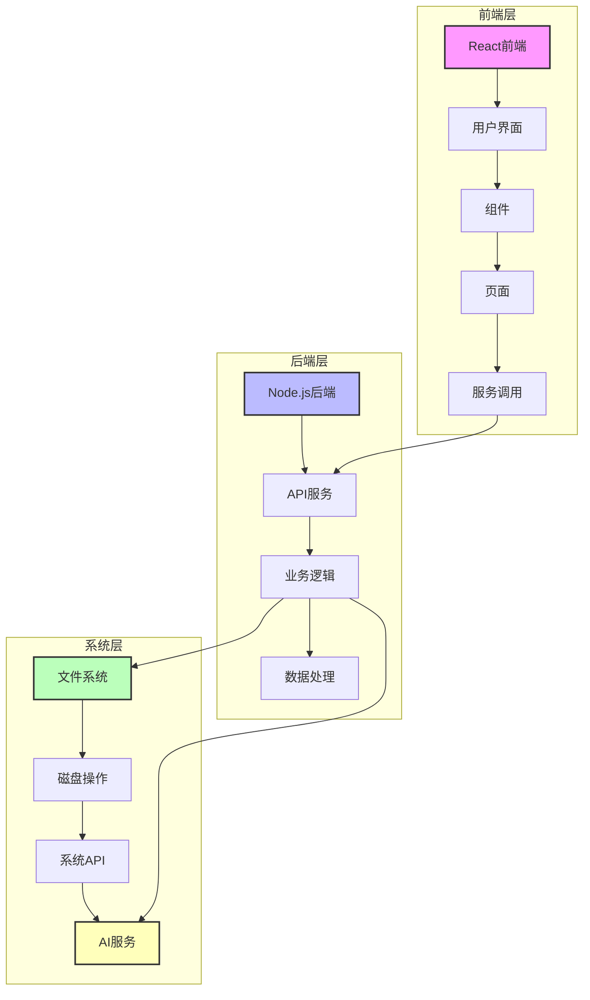
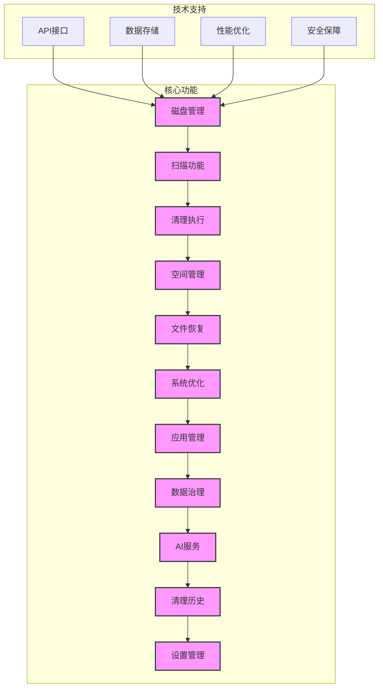
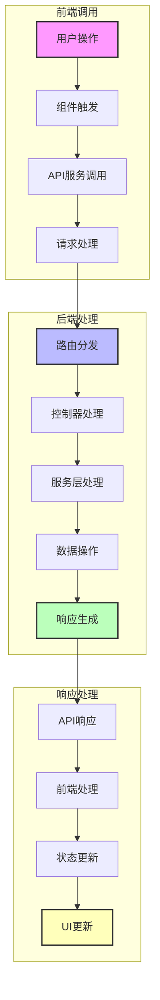
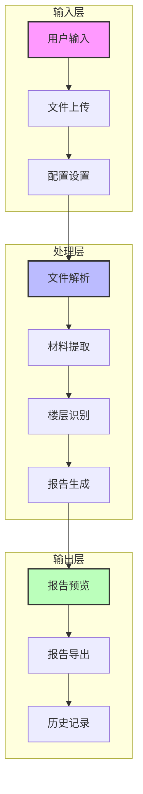
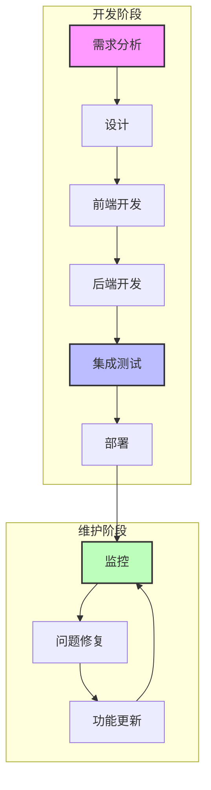

# CleanMaster Pro 项目图谱

## 项目结构

```mermaid
graph TD
    subgraph 项目根目录
        A[README.md] --> B[package.json]
        B --> C[tsconfig.json]
        C --> D[vite.config.ts]
        D --> E[src/]
        E --> F[react/]
        E --> G[CleanMasterPro/]
        F --> H[components/]
        F --> I[pages/]
        F --> J[services/]
        F --> K[contexts/]
        F --> L[hooks/]
        F --> M[types/]
        F --> N[utils/]
        F --> O[assets/]
        F --> P[App.tsx]
        F --> Q[main.tsx]
        F --> R[index.css]
        G --> S[PRD.md]
        G --> T[技术设计文档.md]
    end

    subgraph 前端组件
        H --> H1[common/]
        H --> H2[disk/]
        H --> H3[scan/]
        H --> H4[clean/]
        H --> H5[space/]
        H --> H6[layout/]
        H1 --> H11[Button.tsx]
        H1 --> H12[Card.tsx]
        H2 --> H21[DiskCard.tsx]
        H2 --> H22[DiskHealth.tsx]
        H3 --> H31[ScanProgress.tsx]
        H3 --> H32[ScanOptions.tsx]
        H4 --> H41[CleanConfirm.tsx]
        H4 --> H42[CleanProgress.tsx]
        H5 --> H51[SpaceVisualization.tsx]
        H5 --> H52[LargeFiles.tsx]
        H6 --> H61[Navbar.tsx]
        H6 --> H62[Sidebar.tsx]
    end

    subgraph 前端页面
        I --> I1[HomePage.tsx]
        I --> I2[ScanPage.tsx]
        I --> I3[CleanPage.tsx]
        I --> I4[SpacePage.tsx]
        I --> I5[RecoveryPage.tsx]
        I --> I6[OptimizationPage.tsx]
        I --> I7[AppPage.tsx]
        I --> I8[GovernancePage.tsx]
        I --> I9[HistoryPage.tsx]
        I --> I10[SettingsPage.tsx]
    end

    subgraph 服务层
        J --> J1[api.ts]
        J --> J2[diskService.ts]
        J --> J3[scanService.ts]
        J --> J4[cleanService.ts]
        J --> J5[aiService.ts]
    end

    subgraph 后端服务
        K --> K1[AppContext.tsx]
        K --> K2[ThemeContext.tsx]
    end

    subgraph 自定义钩子
        L --> L1[useDisk.ts]
        L --> L2[useScan.ts]
        L --> L3[useClean.ts]
        L --> L4[useAI.ts]
    end

    subgraph 类型定义
        M --> M1[disk.ts]
        M --> M2[scan.ts]
        M --> M3[clean.ts]
        M --> M4[app.ts]
    end

    subgraph 工具函数
        N --> N1[format.ts]
        N --> N2[storage.ts]
        N --> N3[validation.ts]
        N --> N4[errorHandling.ts]
    end

    subgraph 文档
        S --> T
        T --> U[AGENTS.md]
        U --> V[CONTRACT.md]
    end

    subgraph 外部服务
        J5 --> W[阿里通义千问API]
    end

    style A fill:#f9f,stroke:#333,stroke-width:2px
    style B fill:#bbf,stroke:#333,stroke-width:2px
    style C fill:#bbf,stroke:#333,stroke-width:2px
    style D fill:#bbf,stroke:#333,stroke-width:2px
    style E fill:#fbf,stroke:#333,stroke-width:2px
    style F fill:#ffb,stroke:#333,stroke-width:2px
    style G fill:#ffb,stroke:#333,stroke-width:2px
    style W fill:#bfb,stroke:#333,stroke-width:2px
```

## 系统架构

## 核心功能模块

## API调用流程

## 数据流

## 技术栈

```mermaid
graph TD
    subgraph 前端技术
        A[React 18.x] --> B[TypeScript 5.x]
        B --> C[Tailwind CSS 3.x]
        C --> D[React Router 6.x]
        D --> E[Chart.js]
        E --> F[Axios]
    end

    subgraph 后端技术
        G[Node.js 18.x] --> H[Express 4.x]
        H --> I[SQLite]
        I --> J[阿里通义千问API]
    end

    subgraph 桌面应用
        K[Electron 20.x] --> L[打包工具]
        L --> M[自动更新]
    end

    style A fill:#f9f,stroke:#333,stroke-width:2px
    style G fill:#bbf,stroke:#333,stroke-width:2px
    style K fill:#bfb,stroke:#333,stroke-width:2px
```

## 开发流程

## 总结

CleanMaster Pro 是一个功能强大的智能磁盘清理与系统优化工具，采用现代技术栈和架构设计。项目结构清晰，模块划分合理，技术选型先进，为用户提供了一站式的磁盘管理解决方案。

通过本项目图谱，开发团队可以清晰了解项目的整体结构、组件关系和技术架构，为后续的开发、维护和扩展提供了明确的指导。